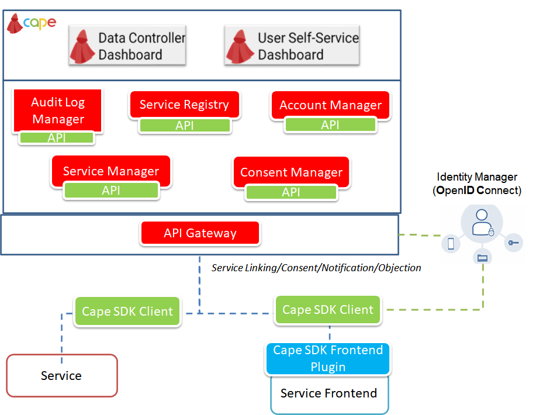

# Architecture Overview

CaPe suite is a web platform based on the microservices paradigm, in which several modules expose a set of APIs through an API Gateway, to be consumed by Frontend Apps and external services. 
The following picture illustrates the architecture of the Cape Suite.

The architecture is composed by a set of core backend microservices (**Cape Server** and **Cape SDK**) and a set of frontend apps (**User Dashboard** and **Data Controller Dashboard**).

**See [CaPe Installation Manual](../install/index.md).**

---
## Cape Server
This is the core of the Cape platform. It implements and exposes all the main functionalities provided by Cape, regarding the lifecycle management and storage of Service Descriptions, Service Linking, Consent Records and Auditing (see [Cape workflow](workflow/workflow.md) section).

Its main components are: 

 - **Account Manager**: Manage the lifecycle of the Cape Account, Account signing keys for Service Linking. 
 - **Service Manager**: Manage the Service Linking internal processes and Service Link Record storage.
 - **Consent Manager**: Manage the Consent Records lifecycle, the generation of Consent Forms, etc.
 - **Auditlog Manager**: Collects aggregated auditing statistics, triggered by incoming Event Logs (ServiceLink, Consent or Data Processing) regarding a specific Account.
 - **Service Registry** : Collects the Service Descriptions and registrations (Signing keys and certificates).

Each of the components above will be deployed with a tighly coupled storage service.

---
## Cape SDK
Cape functionalities, such as Service Linking and Consent Management, can be accessed by a generic external Service, previously described and registered in Cape by its Service Provider, acting as Data Controller.

The Service Provider wanting to use Cape, will use the **Cape Service SDK** package composed by:

 - **Cape SDK Client**: Backend application acting as a client between the Service itself and Cape Server APIs, exposing also its own APIs to interact with SDK Frontend and Data Controller Dashboard. It comprises also the storage to hold the assets received by Cape Server (Signing keys, Service Link Records and Consent Records).
 
 - **Cape SDK Frontend Plugins**: Frontend plugins (e.g. Angular module with an Action Menu) to be embedded in the Service frontend, providing Service Linking and Consenting functionalities, communicating with the SDK Client and then with Cape Server.

---
## Cape Dashboards
The Cape Suite comprises the following Frontend dashboards, which will be used by the End User (Data Subject) and Service Provider (Data Controller) respectively:

 - **User Self-Service Dashboard**: Single point for the End User to have an overview, verify and modify which data are used, and how and for which purpose. In addition can view Event Logs and modify Linked Services and Consents previously given when logged at the Service ends. (See [User Self-Service Dashboard section](dashboards/user-dashboard/index.md) ).
    
 - **Data Controller Dashboard**: Entry point for the Service Provider to manage the Semantic Descriptions and registrations of its own provided Services, view and manage the Service Linking and Consents status given by all the Users of its registered services.(See [Data Controller Dashboard section](dashboards/data-controller-dashboard/index.md) ).
	
	

