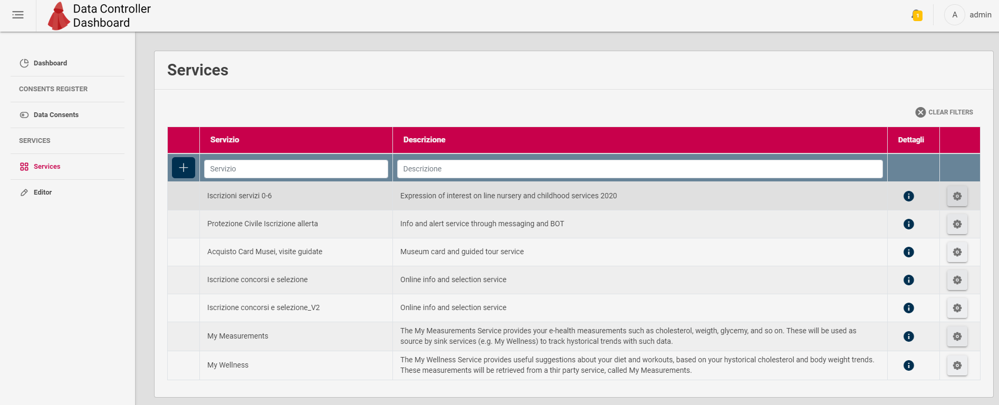
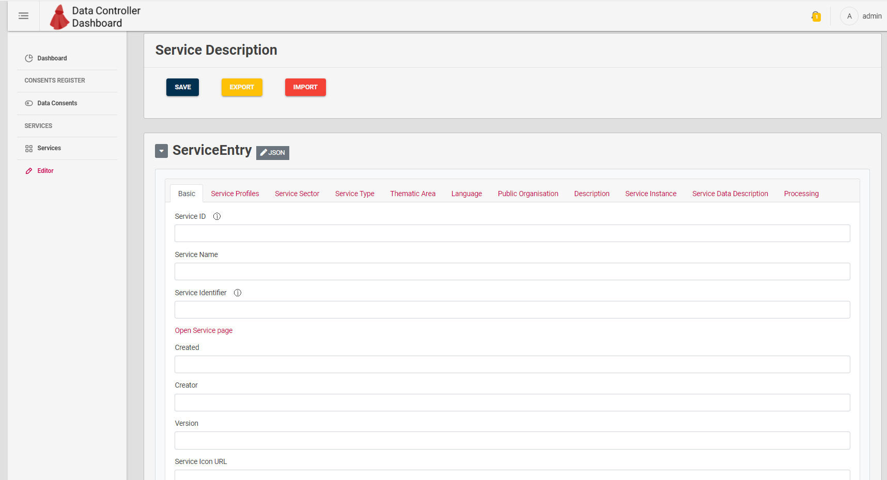
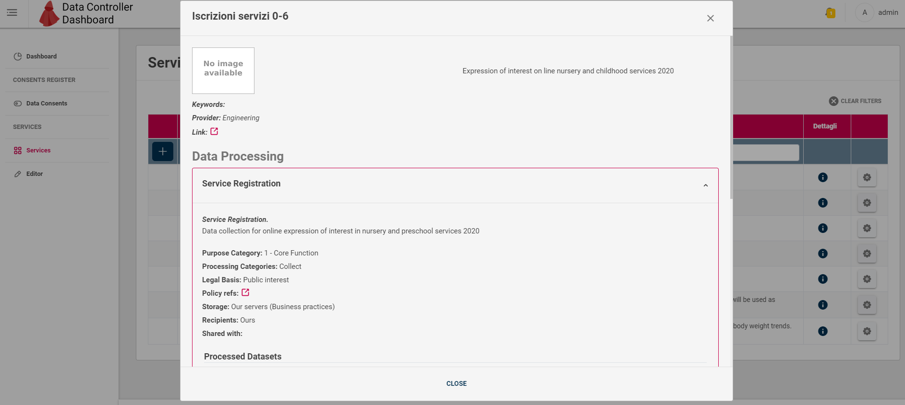
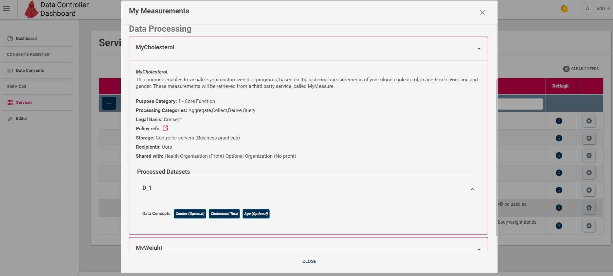
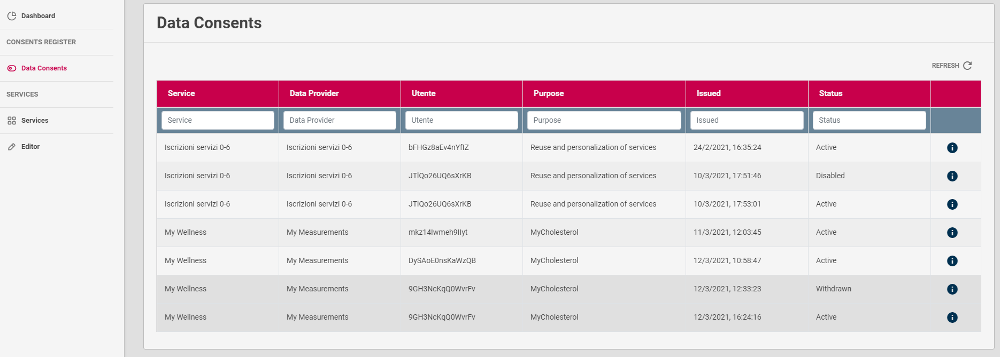
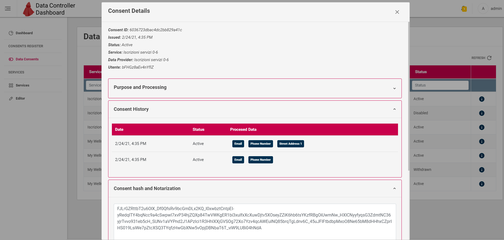

# Data Controller Dashboard - Introduction

Data Controller Dashboard is the Web Portal for Service Providers wanting to manage Data Usage and Consents of their own services with CaPe.

A service Provider, by interacting with Data Controller Dashboard will be able to:

 - Create and Edit all descriptions of Services that will be integrated with Cape, according to the Service Description Data Model defined ([See Service Entry model]() section).
 - Get an overview and manage the lifecycle of Services Descriptions (Create, Import, Export, Register, DeRegister, Delete and so on).
 - Get an overview and details of the Consents that End Users have given at corresponding registered Services, in particular:
   
     - Processing and Purpose details.
     - Consents history.
     - Consents hash and notarization. 
     - Consents raw data (JSON).

The Dashboard represents the frontend of **Cape SDK Client** for that particular Service Provider: **each Dashboard instance will be paired with an instance of Cape SDK Client**.

---
## A Business ID to rule them all

Each Service Provider will have assigned a **Business Id**, which must match with the one configured in the **Cape SDK Client** and then in all the **Service Descriptions** of that Service Provider (**Service Instance** section).

**Note**. At the moment the Business Id value is arbitrary but MUST be unique within the same Cape Server instance and must match with the ones in Cape SDK Client and in the Service Descriptions.

---
## Service Description Editor section

The **Editor** section, reported in the figure below, let the Service Provider to define in a graphical way all the relevant fields and sections of a Service description:

- Basic
- Service Profile
- Service Sector
- Service Type
- Thematic Area
- Language
- Public Organisation
- Description
- Service Instance
- Service Data Description
- Processing

See [Service Description section](service-description.md) for further information about Service Description data model and how to describe a Service on Cape.

Service Provider can perform following operations on a Service Description:

  - Create from scratch.
  - Edit an existing Description from **Services** section of the Dashboard.
  - Save the description being edited to make it available in the **Services** Section.
  - Export a description being edited (as JSON file).
  - Import a previously exported Service Description (as JSON file).
  
  
---
## Services section

In this section the Dashboard provides a table where Service Provider can visualize details of its services and manage the related lifecycle of Services descriptions.

The table can be filtered out by following column values:
 
 - Service name
 - Description content

### Service Description overview
Images below show the popup shown by Dashboard when clicking the (i) button on a Service Row.

Images above show the overview of all the Service Description fields, in particular Data Processing purposes, processed dataset for each purpose and contained Data Concepts for each dataset.
The details highligths following aspects of the Service:

  - Which are the processing purpose cateogory, processing Categories (e.g. aggregate, query, collect)
  - For each purpose which are the processed data

### Actions on Service Descriptions

For each Service row in the table, Data Controller can click the gear button to open the actions menu, in which following operations can be performed on selected Service Description:

 - **Register**: perform **Service Registration** (see [Service Registration in Cape Workflow](../..workflow/service-registration.md) section)
              Registration "fixes" the current Service Description and make it available to the End User in the User Self-Service Dashboard.
 - **Disable**: perform unregistration of current Service Description, in order to make it editable.
 - **Edit**: if Service is not registered (or deregistered by clicking Disable first), open the Editor section to modify its description.
 - **Delete**: delete permanently the selected Service description
 - **View Consents**: view the Consent sections (described below) relative to the selected Service, in order to get the overview of Consents given by all the Service Users.
  

---
## Data Consents Section

In this section the Dashboard provides a table where Service Provider can visualize both the overview and details of all the Consents given, for all registered Services Users.

Image above shows the Consents overview, which rows can be filtered out by following columns values:

 - Service name
 - Data Provider (Sink Service involved in the Consent)
 - User (Surrogate ID involved in the Consent)
 - Processing purpose of the Service (Sink service in case of Consent for data sharing between services)
 - Consent Status (Active, Disabled, Withdrawn)
 
 Clicking the (i) button, Consent details popup will appear, as depicted in following image.
 
 

The popup shows following information:

 - **Purpose and Processing**: details on processing made by the Service (the single Service or the Sink one) involved in Consent (the same of its Service Description)
                           In particular, Data Concepts in the datasets being part of the generated Resource Set for that consent.
 
 - **Consent History**: history of the status and data concepts changes made by End User during Consent lifecycle.
 
 - **Consent hash and Notariazation**: visualize the value of the JWS signature of that Consent Record, made with the private key of the Cape User Account.
                                       The Account's key public part (retrieved through Account Manager API) can be used with the Consent Record Payload to verify that signature.
 
 - **Consent raw data**: visualize the whole Consent Record in JSON format.									   
									   
									   