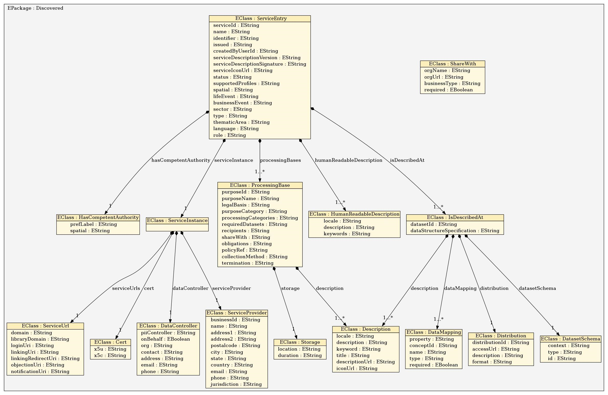

# Data Controller Dashboard - Service Description

The Service Description created and saved by Data Controller, either via Dashboard (recommended) or via SDK APIs, must follow the Service Model defined in CaPe.
Following image depicts the class diagram of Cape Service Model, which is based on [ISA Core Public Service Vocabulary Application Profile (CPSV-AP)]().



---
Following table describes the fields of **Service Entry** class:

| Property name               | Type     | Description                                                                                                                                                                                                                                                  |
|-----------------------------|----------|--------------------------------------------------------------------------------------------------------------------------------------------------------------------------------------------------------------------------------------------------------------|
| serviceId                   | string   | Unique ID for the service                                                                                                                                                                                                                                    |
| name                        | string   | Service Name                                                                                                                                                                                                                                                 |
| identifier                  | string   | Service URI if exists, otherwise the same of Service Id                                                                                                                                                                                                      |
| issued                      | string   | Timestamp of the Service creation                                                                                                                                                                                                                            |
| createdByUserId             | string   | User Id of Service Editor (e.g. Data Controller)                                                                                                                                                                                                             |
| serviceDescriptionVersion   | string   | Service description version number                                                                                                                                                                                                                           |
| serviceDescriptionSignature | string   | JWS signature (signed with Service private key) of the Service Description itself                                                                                                                                                                            |
| serviceIconUrl              | string   | URL pointing to Service Icon file                                                                                                                                                                                                                            |
| status                      | string   | Status of Service Description (Allowed values: *Completed*, *Deprecated*, *UnderDevelopment*, *Withdrawn*)                                                                                                                                                   |
| supportedProfiles           | string[] | Type of Data processing regulation profiles supported by the Service, according to My Data specification (Allowed values: *contract*, *consenting*, *3rd party re-use*, *notification*, *objection*)                                                         |
| spatial                     | string   | Localization of Service                                                                                                                                                                                                                                      |
| lifeEvent                   | string   | If public Service, an important event on Citizen's Life for which this public service is required (see [Life Event classification](http://mapping.semic.eu/vdm/about/html/http%3A%2F%2Fmapping.semic.eu%2Fvdm%2Fid%2Fcv%2F195604dba212093d9f2cafa2a6d7a4ea)) |
| businessEvent               | string   | If public Service, Business Event classification                                                                                                                                                                                                             |
| sector                      | string   | Service Sector (Allowed values: [see NACE codes](Uniuhttps://ec.europa.eu/competition/mergers/cases/index/nace_all.html))                                                                                                                                    |
| type                        | string   | If public Service, the purpose type of government activity (Allowed values: [see Classification of the Functions of Government](https://dd.eionet.europa.eu/vocabulary/eurostat/cofog99/view)                                                                |
| thematicArea                | string   | If public Service, the Thematic Area; e.g. health, recreation, culture, etc.                                                                                                                                                                                 |
| language                    | string   | Languages in which the service is available, in ISO 639-1 format                                                                                                                                                                                             |
| hasCompetentAuthority       | HasCompetentAuthority   | If public Servivce, link to a Public Organization, which is the responsible Agent for the delivery of the Public Service. See below                                                                                                                                    |
| humanReadableDescription    | HumanReadableDescription[] | Array of localized textual descriptions. See below                                 
| serviceInstance             | ServiceInstance | Object describing Service Instance. See below                                                                                                                                                                                                                                                                  |
| isDescribedAt               | IsDescribedAt[]          | Array of objects describing Service Data (Dataset). See below    |                                                                                                                                                                                                                                                         |
| processingBases             | ProcessingBase[]        | Array of objects describing data processing bases of Service. See below     |


---
Following table describes the fields of **HasCompetentAuthority** class:		

| Property name | Type      | Description                                               |
|---------------|-----------|-----------------------------------------------------------|
| locale        | string    | Language used in textual description, in ISO 639-1 format |
| description   | string    | Textual description of the Service                        |
| keyword       | string [] | Array of keywords describing the Service                  |


---
Following table describes the fields of **HumanReadableDescription** class:		

| Property name | Type      | Description                                               |
|---------------|-----------|-----------------------------------------------------------|
| locale        | string    | Language used in textual description, in ISO 639-1 format |
| description   | string    | Textual description of the Service                        |
| keyword       | string [] | Array of keywords describing the Service                  |

---

Following table describes the fields of **ServiceInstance** class:

| Property Name   | Type            | Description                                                   |
|-----------------|-----------------|---------------------------------------------------------------|
| serviceProvider | ServiceProvider | Object describing Service Provider                            |
| cert            | ServiceCertificate | Service Certificate object                                    |
| serviceUrls     | ServiceUrls      | Object describing service Urls used for interacting with CaPe |


---
Following table describes the fields of **ServiceProvider** class:

| Property Name | Type   | Description                                                                                       |
|---------------|--------|---------------------------------------------------------------------------------------------------|
| businessId    | string | Business ID for Service Provider, must match with the one configured in related Cape SDK instance |
| name          | string | Service Provider name                                                                             |
| address1      | string | Principal address                                                                                 |
| address2      | string | Secondary address                                                                                 |
| postalcode    | string | Postal Code                                                                                       |
| city          | string | City                                                                                              |
| state         | string | State                                                                                             |
| country       | string | Country                                                                                           |
| email         | string | Email                                                                                             |
| phone         | string | Phone number                                                                                      |
| jurisdiction  | string | Jurisdiction                                                                                      |


---
Following table describes the fields of **Data Controller** class:

| Property Name | Type   | Description                                        |
|---------------|--------|----------------------------------------------------|
| piiController | string | Name of Data Controller                            |
| onBehalf      | string | Name of entity for which Data Controller is acting |
| org           | string | Organization name                                  |
| contact       | string | Contact Person                                     |
| address       | string | Address                                            |
| email         | string | Email Address                                      |
| phone         | string | Phone number                                       |


---
Following table describes the fields of **ServiceCertificate** class:			

| Property Name | Type   | Description                                                                     |
|---------------|--------|---------------------------------------------------------------------------------|
| X5u           | string | URL pointing to Service X509 Certificate.                                       |
| X5c           | string | BASE64URL encoding of Service X509 Certificate containg its Public Signing Key  |

---
Following table describes the fields of **ServiceUrls** class:			
These Urls depends on how the Cape SDK is installed.

| Property Name      | Type   | Description                                                         |
|--------------------|--------|---------------------------------------------------------------------|
| libraryDomain      | string | Service's integration library url. Endpoint where Cape SDK is publicly reachable (http(s)://host:port)  |
| loginUri           | string | Url of Service Login Page where User will be redirected when start service linking from Operator (Cape User Dashboard |
| linkingRedirectUri | string | ​URI where ​User​ ​will​ ​be redirected​ ​after​ ​service has​ ​been​ ​linked.​ ​Used
in​ ​service​ ​linking starting​ ​from​ ​the service.                  |
| objectionUri       | string | URI for objection (SOON)                                            |
| notificationUri    | string | URI for subscribing notifications (SOON)                            |

---
## Service Dataset Description

Service dataset description (IsDescribedAt) describes the type and structure of the set of personal data processed by the Service. Each dataset will be linked in one or more specific processing base object.

Following table describes the fields of **IsDescribedAt** class:	

| Property Name              | Type                                           | Description                                                                                                         |
|----------------------------|------------------------------------------------|---------------------------------------------------------------------------------------------------------------------|
| datasetId                  | string                                         | Dataset unique identifier                                                                                           |
| description                | Description (same as HumanReadableDescription) | Localized dataset description                                                                                       |
| datasetSchema              | DatasetSchema                                  | Object describing Dataset schema (JSON-LD)                                                                          |
| dataStructureSpecification | string                                         | URL pointing to further description of the data (e.g. to JSON schema)                                               |
| distribution               | Distribution                                   | Object describing distribution point of the Datasets                                                                |
| dataMapping                | DataMapping []                                 | Array of objects describing mapping of each data with a personal data concept belonging to a controlled vocabulary  |

---
Following table describes the fields of **DatasetSchema** class:	

| Property Name | Type                                           | Description                      |
|---------------|------------------------------------------------|----------------------------------|
| context       | string                                         | JSON-LD @context for the dataset |
| type          | Description (same as HumanReadableDescription) | JSON-LD @type for the dataset    |
| id            | DatasetSchema                                  | JSON-LD @id for the dataset      |

---
Following table describes the fields of **Distribution** class:	.

| Property Name  | Type                                           | Description                                                                                                     |
|----------------|------------------------------------------------|-----------------------------------------------------------------------------------------------------------------|
| distributionId | string                                         | Unique identifier of the Distribution                                                                           |
| accessUrl      | string                                         | URL where data is available. The resource at the access URLmay contain information about how to get the Dataset |
| description    | Description (same as HumanReadableDescription) | Localized description of Distribution                                                                           |
| format         | string                                         | Format of data (i.e json, csv...)                                                                               |

---
Following table describes the fields of **DataMapping** class:	

| Property Name | Type    | Description                                                                           |
|---------------|---------|---------------------------------------------------------------------------------------|
| property      | string  | The property name of Data Concept at the Service (i.e. specific field in a form)      |
| conceptId     | string  | Concept identifier referred to a specific personal data (i.e HL7, FOAF, VCARD, etc..) |
| type          | string  | Type of Data: Text, Video, Image, Audio                                               |
| required      | boolean | If the property is mandatory when used in a dataset                                   |


---
## Service Data Processing Purpose Description

Service Processing Base (Data Processing Purpose) describes how one or more datasets, described in the Data Description section above (IsDescribedAt array), are used in the different processing done by the Service.

Following table describes the fields of **ProcessingBase** class:	

 **Property Name**    | **Type**                   | **Description**                                                                                                                                                                                                                                 | **Allowed Values**                                                                                                                                                                                                                                                                                                                                                                                                                                                                                                                                                                                                                                                                                                                                                                                                                                                                                                                                                                                                                                                                                                                                                                                                                                                                                                                                                                                                                                                                                                                                                                                                                                                                                                                                                                                                                                                                
:--------------------:|:--------------------------:|:-----------------------------------------------------------------------------------------------------------------------------------------------------------------------------------------------------------------------------------------------:|:---------------------------------------------------------------------------------------------------------------------------------------------------------------------------------------------------------------------------------------------------------------------------------------------------------------------------------------------------------------------------------------------------------------------------------------------------------------------------------------------------------------------------------------------------------------------------------------------------------------------------------------------------------------------------------------------------------------------------------------------------------------------------------------------------------------------------------------------------------------------------------------------------------------------------------------------------------------------------------------------------------------------------------------------------------------------------------------------------------------------------------------------------------------------------------------------------------------------------------------------------------------------------------------------------------------------------------------------------------------------------------------------------------------------------------------------------------------------------------------------------------------------------------------------------------------------------------------------------------------------------------------------------------------------------------------------------------------------------------------------------------------------------------------------------------------------------------------------------------------------------------:
 purposeId            | string                     | Purpose's Identifier, must be unique within the service description                                                                                                                                                                             | Any                                                                                                                                                                                                                                                                                                                                                                                                                                                                                                                                                                                                                                                                                                                                                                                                                                                                                                                                                                                                                                                                                                                                                                                                                                                                                                                                                                                                                                                                                                                                                                                                                                                                                                                                                                                                                                                                               
 purposeName          | string                     | Human readable Purpose's Name, short name that identifies the purpose                                                                                                                                                                           | Any                                                                                                                                                                                                                                                                                                                                                                                                                                                                                                                                                                                                                                                                                                                                                                                                                                                                                                                                                                                                                                                                                                                                                                                                                                                                                                                                                                                                                                                                                                                                                                                                                                                                                                                                                                                                                                                                               
 legalBasis           | string                     | Legal basis in the "processing" of personal Data according to the GDPR.                                                                                                                                                                         | "**Consent**", "**Contract**", "**Legal Obligation**", "**Vital Interest**", "**Public Interest**", "**Legitimate Interest**"                                                                                                                                                                                                                                                                                                                                                                                                                                                                                                                                                                                                                                                                                                                                                                                                                                                                                                                                                                                                                                                                                                                                                                                                                                                                                                                                                                                                                                                                                                                                                                                                                                                                                                                                                     
 purposeCategory      | string                     | Category of purpose from a controlled taxonomy                                                                                                                                                                                                  |   "Academic Research",                      "Access Control",                      "Advertising ",                      "CommercialInterest",                      "CommercialResearch",                      "CommunicationForCustomerCare",                      "CreateEventRecommendations",                      "CreatePersonalizedRecommendations",                      "CreateProductRecommendations",                      "CustomerCare",                      "DeliveryOfGoods",                      "DirectMarketing",                      "FraudPreventionAndDetection",                      "IdentityVerification",                      "ImproveExistingProductsAndServices",                      "ImproveInternalCRMProcesses",                      "IncreaseServiceRobustness",                      "InternalResourceOptimisation",                      "LegalCompliance",                      "Marketing",                      "NonCommercialResearch",                      "OptimisationForConsumer",                      "OptimisationForController",                      "OptimiseUserInterface",                      "Payment",                      "PersonalisedAdvertising",                      "PersonalisedBenefits",                      "RegistrationAuthentication",                      "ResearchAndDevelopment",                      "Security",                      "SellDataToThirdParties",                      "SellInsightsFromData",                      "SellProductsToDataSubject",                      "SellTargettedAdvertisements",                      "ServiceOptimization",                      "ServicePersonalization",                      "ServiceProvision",                      "SocialMediaMarketing",                      "UsageAnalytics",                      "UserInterfacePersonalisation" 
 processingCategories | string                     | Operations associated with the processing of personal data related to a specific purpose.                                                                                                                                                       | "Acquire",           "Adapt",           "Align",           "Alter",           "Analyse",           "Anonymise",           "AutomatedDecisionMaking",           "Collect",           "Combine",           "Consult",           "Copy",           "DataSource",           "Derive",           "Destruct",           "Disclose",           "DiscloseByTransmission",           "Disseminate",           "Erase",           "EvaluationScoring",           "InnovativeUseOfNewTechnologies",           "LargeScaleProcessing",           "MakeAvailable",           "MatchingCombining",           "Move",           "Obtain",           "Organise",           "Profiling",           "Pseudo-Anonymise",           "Record",           "Remove",           "Restrict",           "Retrieve",           "Share",           "Store",           "Structure",           "Systematic Monitoring",           "Transfer",           "Transform",           "Transmit"                                                                                                                                                                                                                                                                                                                                                                                                                                                                                                                                                                                                                                                                                                                                                                                                                                                                                                                       
 description          | Description [] (see below) | Localized descriptions of processing purpose                                                                                                                                                                                                    | See below                                                                                                                                                                                                                                                                                                                                                                                                                                                                                                                                                                                                                                                                                                                                                                                                                                                                                                                                                                                                                                                                                                                                                                                                                                                                                                                                                                                                                                                                                                                                                                                                                                                                                                                                                                                                                                                                         
 requiredDatasets     | string []                  | Array listing the required datasets (matching datasetId fields of datasets defined in IsDescibedAt section)                                                                                                                                     | String values matching on of the datasetIds defined                                                                                                                                                                                                                                                                                                                                                                                                                                                                                                                                                                                                                                                                                                                                                                                                                                                                                                                                                                                                                                                                                                                                                                                                                                                                                                                                                                                                                                                                                                                                                                                                                                                                                                                                                                                                                               
 storage              | Storage                    | Object describing where and how data will be stored                                                                                                                                                                                             | See below                                                                                                                                                                                                                                                                                                                                                                                                                                                                                                                                                                                                                                                                                                                                                                                                                                                                                                                                                                                                                                                                                                                                                                                                                                                                                                                                                                                                                                                                                                                                                                                                                                                                                                                                                                                                                                                                         
 recipients           | string []                  | List of recipients type of personal data processing                                                                                                                                                                                             | "ours", "delivery", "same", "other-recipient", "unrelated", "public"                                                                                                                                                                                                                                                                                                                                                                                                                                                                                                                                                                                                                                                                                                                                                                                                                                                                                                                                                                                                                                                                                                                                                                                                                                                                                                                                                                                                                                                                                                                                                                                                                                                                                                                                                                                                              
 shareWith            | ShareWith []               | Array of objects describing with whom (which Organization) the consent permits to share data.                                                                                                                                                   | See below                                                                                                                                                                                                                                                                                                                                                                                                                                                                                                                                                                                                                                                                                                                                                                                                                                                                                                                                                                                                                                                                                                                                                                                                                                                                                                                                                                                                                                                                                                                                                                                                                                                                                                                                                                                                                                                                         
 obligations          | Obligations []             | array of objects describin Actions to be performed when an event related to a consent occurs. I.e. when the consent expires (event), then re-solicit consent (activity) or when the consent is revoked (event) then stop processing (activity). | See below                                                                                                                                                                                                                                                                                                                                                                                                                                                                                                                                                                                                                                                                                                                                                                                                                                                                                                                                                                                                                                                                                                                                                                                                                                                                                                                                                                                                                                                                                                                                                                                                                                                                                                                                                                                                                                                                         
 policyRef            | string                     | Url reference to Privacy Policy related to the Consent                                                                                                                                                                                          | Valid urls                                                                                                                                                                                                                                                                                                                                                                                                                                                                                                                                                                                                                                                                                                                                                                                                                                                                                                                                                                                                                                                                                                                                                                                                                                                                                                                                                                                                                                                                                                                                                                                                                                                                                                                                                                                                                                                                        
 collectionMethod     | string                     | Collection method of the Consent (e.g. at login, manually by operator, etc.)                                                                                                                                                                    | Any                                                                                                                                                                                                                                                                                                                                                                                                                                                                                                                                                                                                                                                                                                                                                                                                                                                                                                                                                                                                                                                                                                                                                                                                                                                                                                                                                                                                                                                                                                                                                                                                                                                                                                                                                                                                                                                                               
 termination          | string                     | Termination rule of legal basis under which personal data can be processed                                                                                                                                                                      | Any                                                                                                                                                                                                                                                                                                                                                                                                                                                                                                                                                                                                                                                                                                                                                                                                                                                                                                                                                                                                                                                                                                                                                                                                                                                                                                                                                                                                                                                                                                                                                                                                                                                                                                                                                                                                                                                                               

---
Following table describes the fields of **Description** class:	

 **Property Name** | **Type** | **Description**                                 | **Allowed values**     
:-----------------:|:--------:|:-----------------------------------------------:|:----------------------:
 locale            | string   | Language used in description                    | ISO639-1 format string 
 title             | string   | Description title of processing base            | any                    
 description       | string   | Textual description of processing base          | any                    
 iconUrl           | string   | Link of icon identifying the type of processing | Any valid URL          

---
Following table describes the fields of **Storage** class:	

 **Property Name** | **Type** | **Description**  | **Allowed values**                                                                                                                                                                                                                        
:-----------------:|:--------:|:----------------:|:-----------------------------------------------------------------------------------------------------------------------------------------------------------------------------------------------------------------------------------------:
 location          | string   | Storage location |   "Controller servers",                            "Eu",                            "Third countries",                            "Our servers",                            "Processor servers",                            "Third party" 
 duration          | string   | Storage duration |      "Business practices",                            "Legal requirement",                            "Stated purpose",                            "Indefinitely"                                                                         

---
Following table describes the fields of **ShareWith** class:
	
 **Property Name** | **Type** | **Description**              | **Allowed values**    
:-----------------:|:--------:|:----------------------------:|:---------------------:
 orgName           | string   | Organization name            | Any                   
 businessType      | string   | Organization's business type | "Profit", "No-Profit" 

---
Following table describes the fields of **Obligations** class:

 **Property Name** | **Type** | **Description**                                              | **Allowed values** 
:-----------------:|:--------:|:------------------------------------------------------------:|:------------------:
 event             | string   | The event based on which an activity is required to be done. | any                
 activity          | string   | Activity required to be done when the related event occures  | any                


	
---
**Note**. The Processing bases described in the Service Description will be used in the Consenting phase to create the Usage Rules associated to the given Consent. 
          In this way the Consent will indicate which data and how can be used
---
**Note**. All the fields above are mandatory simple string values (and enum strings in several fields, according to the [W3C's Data Privacy Vocabulary](https://dpvcg.github.io/dpv/)) at the moment, feel free to open an issue [here](https://github.com/OPSILab/Cape/issues) and discuss about the usage of one or more fields.
          
**SOON**. The fields will be typed according to Semantic Typing ([RDF based vocabularies](https://raw.githubusercontent.com/catalogue-of-services-isa/CPSV-AP/master/releases/2.2.1/SC2015DI07446_D02.02_CPSV-AP_v2.2.1_RDF_Schema_v1.00.ttl) and [JSON-LD](https://raw.githubusercontent.com/catalogue-of-services-isa/CPSV-AP/master/releases/2.2.1/CPSV-AP_v2.2.1.jsonld) contextes) defined by ISA CPSV-AP and other initiatives.


---
## Service Description - JSON Schema
The Class diagram representation described above will imply in pratices the generation of a JSON, according to the following JSON Schema:

```
{
   "definitions": {},
   "$schema": "http://json-schema.org/draft-07/schema#",
   "$id": "http://example.com/root.json",
   "type": "object",
   "required": [
      "serviceId",
      "name",
      "identifier",
      "issued",
      "createdByUserId",
      "serviceDescriptionVersion",
      "serviceIconUrl",
      "status",
      "supportedProfiles",
      "spatial",
      "lifeEvent",
      "businessEvent",
      "sector",
      "type",
      "thematicArea",
      "language",
      "hasCompetentAuthority",
      "humanReadableDescription",
      "serviceInstance",
      "isDescribedAt",
      "processingBases",
      "role"
   ],
   "properties": {
      "serviceId": {
         "type": "string",
         "default": ""
      },
      "name": {
         "type": "string",
         "default": ""
      },
      "identifier": {
         "type": "string",
         "default": ""
      },
      "issued": {
         "type": "string",
         "default": ""
      },
      "createdByUserId": {
         "type": "string",
         "default": ""
      },
      "serviceDescriptionVersion": {
         "type": "string",
         "default": ""
      },
      "serviceDescriptionSignature": {
         "type": "string",
         "default": ""
      },
      "serviceIconUrl": {
         "type": "string",
         "default": ""
      },
      "status": {
         "type": "string",
         "default": ""
      },
      "supportedProfiles": {
         "type": "array",
         "items": {
            "type": "string",
            "default": "",
            "enum": [
               "Contract",
               "Consenting",
               "3rd party re-use",
               "Notification",
               "Objection"
            ]
         }
      },
      "spatial": {
         "type": "string",
         "default": ""
      },
      "lifeEvent": {
         "type": "string",
         "default": ""
      },
      "businessEvent": {
         "type": "string",
         "default": ""
      },
      "sector": {
         "type": "array",
         "items": {
            "type": "string",
            "default": ""
         }
      },
      "type": {
         "type": "array",
         "items": {
            "type": "string",
            "default": ""
         }
      },
      "thematicArea": {
         "type": "array",
         "items": {
            "type": "string",
            "default": ""
         }
      },
      "language": {
         "type": "array",
         "items": {
            "type": "string",
            "default": ""
         }
      },
      "hasCompetentAuthority": {
         "type": "object",
         "required": [
            "prefLabel",
            "spatial"
         ],
         "properties": {
            "prefLabel": {
               "type": "string",
               "default": ""
            },
            "spatial": {
               "type": "string",
               "default": ""
            }
         }
      },
      "humanReadableDescription": {
         "type": "array",
         "items": {
            "type": "object",
            "required": [
               "locale",
               "description",
               "keywords"
            ],
            "properties": {
               "locale": {
                  "type": "string",
                  "default": ""
               },
               "description": {
                  "type": "string",
                  "default": ""
               },
               "keywords": {
                  "type": "array",
                  "items": {
                     "type": "string",
                     "default": ""
                  }
               }
            }
         }
      },
      "serviceInstance": {
         "type": "object",
         "required": [
            "serviceProvider",
            "cert",
            "serviceUrls",
            "dataController"
         ],
         "properties": {
            "serviceProvider": {
               "type": "object",
               "required": [
                  "businessId",
                  "name",
                  "address1",
                  "address2",
                  "postalcode",
                  "city",
                  "state",
                  "country",
                  "email",
                  "phone",
                  "jurisdiction"
               ],
               "properties": {
                  "businessId": {
                     "type": "string",
                     "default": ""
                  },
                  "name": {
                     "type": "string",
                     "default": ""
                  },
                  "address1": {
                     "type": "string",
                     "default": ""
                  },
                  "address2": {
                     "type": "string",
                     "default": ""
                  },
                  "postalcode": {
                     "type": "string",
                     "default": ""
                  },
                  "city": {
                     "type": "string",
                     "default": ""
                  },
                  "state": {
                     "type": "string",
                     "default": ""
                  },
                  "country": {
                     "type": "string",
                     "default": ""
                  },
                  "email": {
                     "type": "string",
                     "default": ""
                  },
                  "phone": {
                     "type": "string",
                     "default": ""
                  },
                  "jurisdiction": {
                     "type": "string",
                     "default": ""
                  }
               }
            },
            "cert": {
               "type": "object",
               "required": [
                  "x5u"
               ],
               "properties": {
                  "x5u": {
                     "type": "string",
                     "default": ""
                  },
                  "x5c": {
                     "type": "array",
                     "items": {
                        "type": "string"
                     }
                  }
               }
            },
            "serviceUrls": {
               "type": "object",
               "required": [
                  "domain",
                  "libraryDomain",
                  "loginUri",
                  "linkingUri",
                  "linkingRedirectUri",
                  "objectionUri",
                  "notificationUri"
               ],
               "properties": {
                  "domain": {
                     "type": "string",
                     "default": ""
                  },
                  "libraryDomain": {
                     "type": "string",
                     "default": ""
                  },
                  "loginUri": {
                     "type": "string",
                     "default": ""
                  },
                  "linkingUri": {
                     "type": "string",
                     "default": ""
                  },
                  "linkingRedirectUri": {
                     "type": "string",
                     "default": ""
                  },
                  "objectionUri": {
                     "type": "string",
                     "default": ""
                  },
                  "notificationUri": {
                     "type": "string",
                     "default": ""
                  }
               }
            },
            "dataController": {
               "type": "object",
               "required": [
                  "piiController",
                  "onBehalf",
                  "org",
                  "contact",
                  "address",
                  "email",
                  "phone"
               ],
               "properties": {
                  "piiController": {
                     "type": "string"
                  },
                  "onBehalf": {
                     "type": "boolean"
                  },
                  "org": {
                     "type": "string"
                  },
                  "contact": {
                     "type": "string"
                  },
                  "address": {
                     "type": "string"
                  },
                  "email": {
                     "type": "string"
                  },
                  "phone": {
                     "type": "string"
                  },
                  "operatorName": {
                     "type": "string"
                  }
               }
            }
         }
      },
      "isDescribedAt": {
         "type": "array",
         "items": {
            "type": "object",
            "required": [
               "datasetId",
               "description",
               "datasetSchema",
               "dataStructureSpecification",
               "distribution",
               "dataMapping"
            ],
            "properties": {
               "datasetId": {
                  "type": "string",
                  "default": ""
               },
               "description": {
                  "type": "array",
                  "items": {
                     "type": "object",
                     "required": [
                        "locale",
                        "description",
                        "keyword"
                     ],
                     "properties": {
                        "locale": {
                           "type": "string",
                           "default": ""
                        },
                        "description": {
                           "type": "string",
                           "default": ""
                        },
                        "keyword": {
                           "type": "array",
                           "items": {
                              "type": "string",
                              "default": ""
                           }
                        }
                     }
                  }
               },
               "datasetSchema": {
                  "type": "object",
                  "required": [
                     "context",
                     "type",
                     "id"
                  ],
                  "properties": {
                     "context": {
                        "type": "string",
                        "default": ""
                     },
                     "type": {
                        "type": "string",
                        "default": ""
                     },
                     "id": {
                        "type": "string",
                        "default": ""
                     }
                  }
               },
               "dataStructureSpecification": {
                  "type": "string",
                  "default": ""
               },
               "distribution": {
                  "type": "object",
                  "required": [
                     "distributionId",
                     "accessUrl",
                     "description",
                     "format"
                  ],
                  "properties": {
                     "distributionId": {
                        "type": "string",
                        "default": ""
                     },
                     "accessUrl": {
                        "type": "string",
                        "default": ""
                     },
                     "description": {
                        "type": "array",
                        "items": {
                           "type": "object",
                           "required": [
                              "locale",
                              "description"
                           ],
                           "properties": {
                              "locale": {
                                 "type": "string",
                                 "default": ""
                              },
                              "description": {
                                 "type": "string",
                                 "default": ""
                              }
                           }
                        }
                     },
                     "format": {
                        "type": "string",
                        "default": ""
                     }
                  }
               },
               "dataMapping": {
                  "type": "array",
                  "items": {
                     "type": "object",
                     "required": [
                        "property",
                        "conceptId",
                        "name",
                        "type",
                        "required"
                     ],
                     "properties": {
                        "property": {
                           "type": "string",
                           "default": ""
                        },
                        "conceptId": {
                           "type": "string",
                           "default": ""
                        },
                        "name": {
                           "type": "string",
                           "default": ""
                        },
                        "type": {
                           "type": "string",
                           "default": ""
                        },
                        "required": {
                           "type": "boolean",
                           "default": false
                        }
                     }
                  }
               }
            }
         }
      },
      "processingBases": {
         "type": "array",
         "items": {
            "type": "object",
            "required": [
               "purposeId",
               "purposeName",
               "legalBasis",
               "purposeCategory",
               "processingCategories",
               "description",
               "requiredDatasets",
               "storage",
               "recipients",
               "shareWith",
               "obligations",
               "policyRef",
               "collectionMethod",
               "termination"
            ],
            "properties": {
               "purposeId": {
                  "type": "string",
                  "default": ""
               },
               "purposeName": {
                  "type": "string",
                  "default": ""
               },
               "legalBasis": {
                  "type": "string",
                  "default": "Consent",
                  "enum": [
                     "Consent",
                     "Contract",
                     "Legal obligation",
                     "Vital interest",
                     "Public interest",
                     "Legitimate interest"
                  ]
               },
               "purposeCategory": {
                  "type": "string",
                  "default": "",
                  "enum": [
                     "Academic Research",
                     "Access Control",
                     "Advertising ",
                     "CommercialInterest",
                     "CommercialResearch",
                     "CommunicationForCustomerCare",
                     "CreateEventRecommendations",
                     "CreatePersonalizedRecommendations",
                     "CreateProductRecommendations",
                     "CustomerCare",
                     "DeliveryOfGoods",
                     "DirectMarketing",
                     "FraudPreventionAndDetection",
                     "IdentityVerification",
                     "ImproveExistingProductsAndServices",
                     "ImproveInternalCRMProcesses",
                     "IncreaseServiceRobustness",
                     "InternalResourceOptimisation",
                     "LegalCompliance",
                     "Marketing",
                     "NonCommercialResearch",
                     "OptimisationForConsumer",
                     "OptimisationForController",
                     "OptimiseUserInterface",
                     "Payment",
                     "PersonalisedAdvertising",
                     "PersonalisedBenefits",
                     "RegistrationAuthentication",
                     "ResearchAndDevelopment",
                     "Security",
                     "SellDataToThirdParties",
                     "SellInsightsFromData",
                     "SellProductsToDataSubject",
                     "SellTargettedAdvertisements",
                     "ServiceOptimization",
                     "ServicePersonalization",
                     "ServiceProvision",
                     "SocialMediaMarketing",
                     "UsageAnalytics",
                     "UserInterfacePersonalisation"
                  ]
               },
               "processingCategories": {
                  "type": "array",
                  "items": {
                     "type": "string",
                     "enum": [
                        "Acquire",
                        "Adapt",
                        "Align",
                        "Alter",
                        "Analyse",
                        "Anonymise",
                        "AutomatedDecisionMaking",
                        "Collect",
                        "Combine",
                        "Consult",
                        "Copy",
                        "DataSource",
                        "Derive",
                        "Destruct",
                        "Disclose",
                        "DiscloseByTransmission",
                        "Disseminate",
                        "Erase",
                        "EvaluationScoring",
                        "InnovativeUseOfNewTechnologies",
                        "LargeScaleProcessing",
                        "MakeAvailable",
                        "MatchingCombining",
                        "Move",
                        "Obtain",
                        "Organise",
                        "Profiling",
                        "Pseudo-Anonymise",
                        "Record",
                        "Remove",
                        "Restrict",
                        "Retrieve",
                        "Share",
                        "Store",
                        "Structure",
                        "Systematic Monitoring",
                        "Transfer",
                        "Transform",
                        "Transmit"
                     ]
                  }
               },
               "description": {
                  "type": "array",
                  "items": {
                     "type": "object",
                     "required": [
                        "locale",
                        "title",
                        "description",
                        "descriptionUrl",
                        "iconUrl"
                     ],
                     "properties": {
                        "locale": {
                           "type": "string",
                           "default": ""
                        },
                        "title": {
                           "type": "string",
                           "default": ""
                        },
                        "description": {
                           "type": "string",
                           "default": ""
                        },
                        "descriptionUrl": {
                           "type": "string",
                           "default": ""
                        },
                        "iconUrl": {
                           "type": "string",
                           "default": ""
                        }
                     }
                  }
               },
               "requiredDatasets": {
                  "type": "array",
                  "items": {
                     "type": "string",
                     "default": ""
                  }
               },
               "storage": {
                  "type": "object",
                  "required": [
                     "location",
                     "duration"
                  ],
                  "properties": {
                     "location": {
                        "type": "string",
                        "enum": [
                           "Controller servers",
                           "Eu",
                           "Third countries",
                           "Our servers",
                           "Processor servers",
                           "Third party"
                        ]
                     },
                     "duration": {
                        "type": "string",
                        "enum": [
                           "Business practices",
                           "Legal requirement",
                           "Stated purpose",
                           "Indefinitely"
                        ]
                     }
                  }
               },
               "recipients": {
                  "type": "array",
                  "items": {
                     "type": "string",
                     "enum": [
                        "Ours",
                        "Delivery",
                        "Same",
                        "Other recipient",
                        "Unrelated",
                        "Public"
                     ]
                  }
               },
               "shareWith": {
                  "type": "array",
                  "items": {
                     "type": "object",
                     "required": [
                        "orgName",
                        "orgUrl",
                        "businessType",
                        "required"
                     ],
                     "properties": {
                        "orgName": {
                           "type": "string",
                           "default": ""
                        },
                        "orgUrl": {
                           "type": "string",
                           "default": ""
                        },
                        "businessType": {
                           "type": "string",
                           "enum": [
                              "Profit",
                              "No profit"
                           ]
                        },
                        "required": {
                           "type": "boolean",
                           "default": ""
                        }
                     }
                  }
               },
               "obligations": {
                  "type": "array",
                  "items": {
                     "type": "object",
                     "required": [
                        "event",
                        "activity"
                     ],
                     "properties": {
                        "event": {
                           "type": "string",
                           "default": ""
                        },
                        "activity": {
                           "type": "string",
                           "default": ""
                        }
                     }
                  }
               },
               "policyRef": {
                  "type": "string",
                  "default": ""
               },
               "collectionMethod": {
                  "type": "string",
                  "default": ""
               },
               "termination": {
                  "type": "string",
                  "default": ""
               }
            }
         }
      },
      "role": {
         "type": "string",
         "enum": [
            "Sink",
            "Source"
         ]
      }
   }
}
```


---
## Service Description - JSON Example

The following is an example of Service Description (JSON) following the Class diagram and JSON Schema described above.
This will be the result of compiling the different sections of the Data Controller Dashboard (Editor Section).

```
{
   "serviceId": "MYW20",
   "name": "My Wellness",
   "identifier": "http://localhost:82/cape-playground/pages/services/my-wellness",
   "issued": "2020-18-06T13:48:00Z",
   "createdByUserId": "Cape Developers",
   "serviceDescriptionVersion": "1.0",
   "serviceDescriptionSignature": "",
   "serviceIconUrl": "http://localhost:82/cape-playground/my-wellness/favicon.ico",
   "status": "Completed",
   "supportedProfiles": [
      "Consenting"
   ],
   "spatial": "ITA-Italy",
   "lifeEvent": "other",
   "businessEvent": "other",
   "sector": [
      "other"
   ],
   "type": [
      "other"
   ],
   "thematicArea": [
      "other"
   ],
   "language": [
      "it",
      "en"
   ],
   "hasCompetentAuthority": {
      "prefLabel": "Engineering",
      "spatial": "ITA-Italy"
   },
   "humanReadableDescription": [
      {
         "locale": "en",
         "description": "The My Wellness Service provides useful suggestions about your diet and workouts, based on your hystorical cholesterol and body weight trends. These measurements will be retrieved from a thir party service, called My Measurements.",
         "keywords": []
      },
      {
         "locale": "it",
         "description": "Il Servizio My Wellness fornisce utili suggerimenti sulla tua dieta e i workouts, basati sull'andamento storico del tuo colesterolo e peso corporeo. Tali misurazioni verranno recuperate da un servizio terzo, chiamato My Measurements.",
         "keywords": []
      }
   ],
   "serviceInstance": {
      "serviceProvider": {
         "businessId": "ENG",
         "name": "Engineering",
         "address1": "",
         "address2": "",
         "postalcode": "",
         "city": "",
         "state": "",
         "country": "",
         "email": "",
         "phone": "",
         "jurisdiction": "EU"
      },
      "cert": {
         "x5u": "",
         "x5c": []
      },
      "serviceUrls": {
         "domain": "http://localhost82/cape-playground",
         "libraryDomain": "http://service-sdk:8085/cape-service-sdk",
         "loginUri": "http://localhost:82/cape-playground/pages/services/my-wellness",
         "linkingUri": "http://service-sdk:8085/cape-service-sdk/api/v2/slr/linking",
         "linkingRedirectUri": "http://localhost:82/cape-playground",
         "objectionUri": "",
         "notificationUri": ""
      },
      "dataController": {
         "piiController": "John Doe",
         "onBehalf": false,
         "org": "ENG",
         "contact": "",
         "address": "",
         "email": "johndoe@example.com",
         "phone": "+39222222",
         "operatorName": "John Doe"
      }
   },
   "isDescribedAt": [
      {
         "datasetId": "D_1",
         "description": [
            {
               "locale": "en",
               "description": "This dataset represents data used for the MyCholesterol purpose",
               "keyword": []
            },
            {
               "locale": "it",
               "description": "Questo dataset rappresenta i dati utilizzati per il purpose MyCholesterol",
               "keyword": []
            }
         ],
         "datasetSchema": {
            "context": "",
            "type": "",
            "id": ""
         },
         "dataStructureSpecification": "",
         "distribution": {
            "distributionId": "",
            "accessUrl": "",
            "description": [],
            "format": ""
         },
         "dataMapping": [
            {
               "property": "sex",
               "conceptId": "personal_details_sex",
               "name": "Gender",
               "type": "text",
               "required": false
            },
            {
               "property": "cholesterol",
               "conceptId": "cholesterol_total",
               "name": "Blood Cholesterol",
               "type": "text",
               "required": true
            },
            {
               "property": "age",
               "conceptId": "personal_details_age",
               "name": "Age",
               "type": "text",
               "required": false
            }
         ]
      },
      {
         "datasetId": "D_2",
         "description": [
            {
               "locale": "en",
               "description": "This dataset represents data used for the MyWeight purpose",
               "keyword": []
            },
            {
               "locale": "it",
               "description": "Questo dataset rappresenta i dati utilizzati per il purpose MyWeight",
               "keyword": []
            }
         ],
         "datasetSchema": {
            "context": "",
            "type": "",
            "id": ""
         },
         "dataStructureSpecification": "",
         "distribution": {
            "distributionId": "",
            "accessUrl": "",
            "description": [],
            "format": ""
         },
         "dataMapping": [
            {
               "property": "sex",
               "conceptId": "personal_details_sex",
               "name": "Gender",
               "type": "text",
               "required": false
            },
            {
               "property": "weight",
               "conceptId": "personal_details_body_weight",
               "name": "Body Weight",
               "type": "text",
               "required": true
            },
            {
               "property": "age",
               "conceptId": "personal_details_age",
               "name": "Age",
               "type": "text",
               "required": false
            }
         ]
      }
   ],
   "processingBases": [
      {
         "purposeId": "1",
         "purposeName": "MyCholesterol",
         "legalBasis": "Consent",
         "purposeCategory": "CommercialInterest",
         "processingCategories": [
            "Copy",
            "Analyse",
            "Profiling",
            "Store"
         ],
         "description": [
            {
               "locale": "en",
               "title": "MyCholesterol",
               "description": "This purpose enables to visualize your customized diet programs, based on the historical measurements of your blood cholesterol, in addition to your age and gender. These measurements will be retrieved from a third party service, called MyMeasure.",
               "descriptionUrl": "",
               "iconUrl": ""
            },
            {
               "locale": "it",
               "title": "MyCholesterol",
               "description": "Questo purpose permette di visualizzare dei programmi di dieta personalizzati, basati sullo storico delle misurazioni del tuo colesterolo nel sangue, oltre alla tua età e sesso. Tali misurazioni verrranno recuperate da un servizio terzo, chiamato MyMeasure.",
               "descriptionUrl": "",
               "iconUrl": ""
            }
         ],
         "requiredDatasets": [
            "D_1"
         ],
         "storage": {
            "location": "Controller servers",
            "duration": "Business practices"
         },
         "recipients": [
            "Ours"
         ],
         "shareWith": [
            {
               "orgName": "Health Organization",
               "orgUrl": "www.example.com",
               "businessType": "Profit",
               "required": true
            },
            {
               "orgName": "Optional Organization",
               "orgUrl": "www.example.com",
               "businessType": "No profit",
               "required": false
            }
         ],
         "obligations": [],
         "policyRef": "http://mywellness.com/policy",
         "collectionMethod": "Automatic aggregation",
         "termination": "None"
      },
      {
         "purposeId": "2",
         "purposeName": "MyWeight",
         "legalBasis": "Consent",
         "purposeCategory": "CommercialInterest",
         "processingCategories": [
            "Copy",
            "Analyse",
            "Profiling",
            "Store"
         ],
         "description": [
            {
               "locale": "en",
               "title": "MyWeight",
               "description": "This purpose enables to visualize your customized workout programs, based on the historical measurements of your body weight, in addition to your age and gender. These measurements will be retrieved from a third party service, called MyMeasure.",
               "descriptionUrl": "",
               "iconUrl": ""
            },
            {
               "locale": "it",
               "title": "MyWeight",
               "description": "Questo purpose permette di visualizzare dei programmi di workout personalizzati, basati sullo storico delle misurazioni del tuo peso corporeo, oltre alla tua età e sesso. Tali misurazioni verrranno recuperate da un servizio terzo, chiamato MyMeasure.",
               "descriptionUrl": "",
               "iconUrl": ""
            }
         ],
         "requiredDatasets": [
            "D_2"
         ],
         "storage": {
            "location": "Controller servers",
            "duration": "Business practices"
         },
         "recipients": [
            "Ours"
         ],
         "shareWith": [
            {
               "orgName": "Health Organization",
               "orgUrl": "http://www.example.com",
               "businessType": "Profit",
               "required": true
            },
            {
               "orgName": "Optional Organization",
               "orgUrl": "www.example.com",
               "businessType": "No profit",
               "required": false
            }
         ],
         "obligations": [
            {
               "event": "",
               "activity": ""
            }
         ],
         "policyRef": "http://mywellness.com/policy",
         "collectionMethod": "Automatic aggregation",
         "termination": "None"
      }
   ],
   "role": "Sink"
}
```