# User Self-Service Dashboard

---
## Introduction
User Self-Service Dashboard is the Web portal for End Users (acting as Data Subjects) to manage their Cape Account, Service Links, Consents and get an overview of what is happening with their Personal Data.

In the **Dashboard** section (image below), CaPe Dashboard provides to the Data Subject a graphical overwiew displaying all the punctual information and statistics on type of personal data, on a timeline basis, grouped by categories on who, when and for what purpose their personal data are being processed.

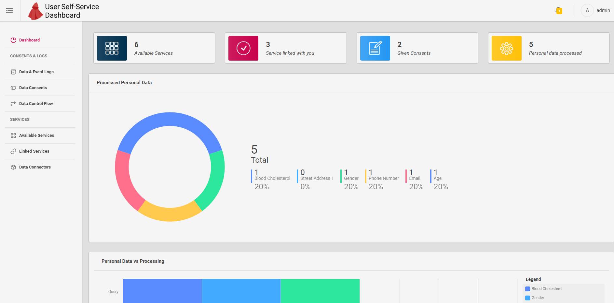

Cape End User, by interacting with User Self-Service Dashboard, will be able to:

  - Get an overview with charts of his personal data being processed
  - Get an overview and manage available Services and linked Services
  - Get an overview and manage the lifecycle of given Consents
  
---
## Available Services section

In this section End User can view the table of Services previously registered by Service Providers and ready to be linked to hist/her Cape Account.
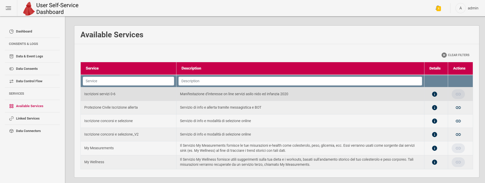

User can start the Service Linking by clicking the Link icon in **Actions** column.

In the image below the Service Description details popup shown by Dashboard when clicking the (i) button on a Service row.

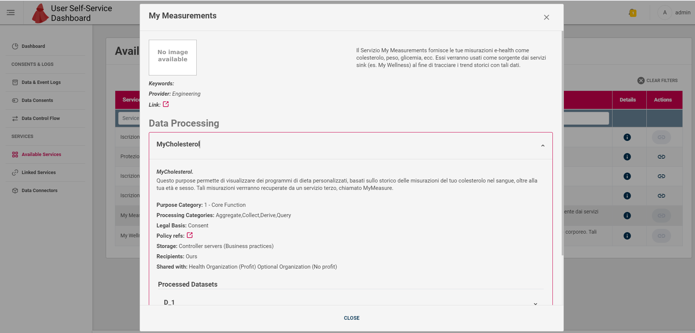

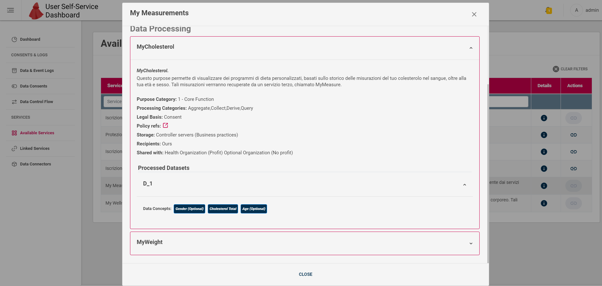

Images above show the overview of all the Service Description fields, in particular Data Processing purposes, processed dataset for each purpose and contained Data Concepts for each dataset.
The details highlights following aspects of the Service:

  - Which are the processing purpose, processing Categories (e.g. aggregate, query, collect)
    - For each purpose which are the processed data
  - Legal Basis supported by this Service
  - Link to the related Policy Statement
  - Storage, Recipients and Share With details	
  
---
## Linked Services section

In this section (image below) End User can view the table of Services that have been linked to his/her Cape Account, checking which services are connected to his account and changing their status (enable, disable).

**Note**.
Disabling a linked Service will put all its active Consents (if any) in the *Disabled* state; re-enabling the linked Service will restore Consents status.

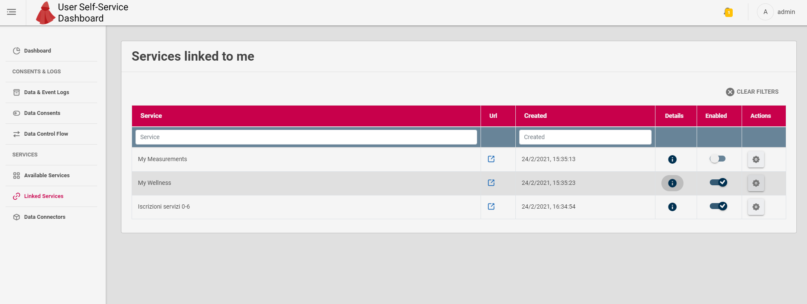

In the image below the Service Description details popup shown by Dashboard when clicking the (i) button on a Service row.

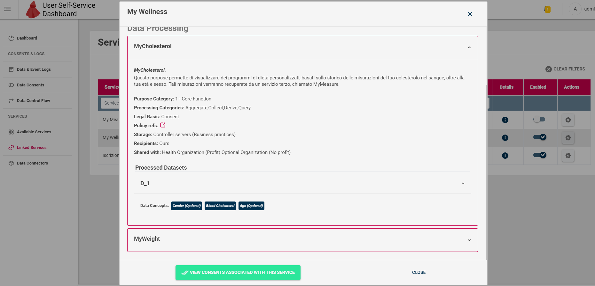

Images above shows the overview of all the Service Description fields (same as previous section).

In addiction, if any, the button in the bottom left enables to view Consents associated to that Linked Service.

----
## Data Consents section

In this section (image below) End User can check the list and details of the Consents given by conducting the [Consenting phase in Cape worflow](../../workflow/consenting.md)).

Consents list can be filtered out by:

 - **Consent status**
 - **Service(s) involved in Consent**
 - **Purpose category**
 - **Processing category**
 
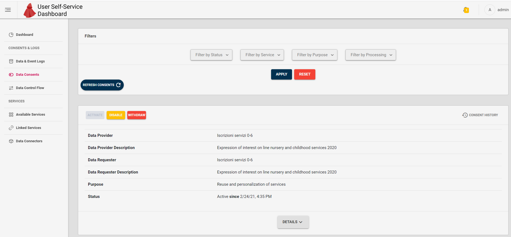

In particular, each Consent Card will give details about:
 
 - **Data Provider and Description**: Name and description of the Service acting as Source in the consent
 - **Data Requester and Description**: Name and description of the Service acting as Sink in the consent in case of sharing between services, otherwise (within service case) is the same service as Data Provider
 - **Data Processing Purpose**: which is the processing purpose regulated by the consent
 - **Status**: The current Consent Status and related timestamp.
 
---
### Actions on Consents

#### Consent status

For each Consent card, End User can select the upper left buttons to change the **Status** of the relative Consent:
 
  
  - **Activate**: enables the previously disabled Consent
  - **Disable**: disable the Consent
  - **Withdraw**: revoke the Consent, a new one must be given by the Consenting phase.

**Consent History** button in the upper right part of the Consent card let to open the popup with details on all the status transictions made to the Consent in time.

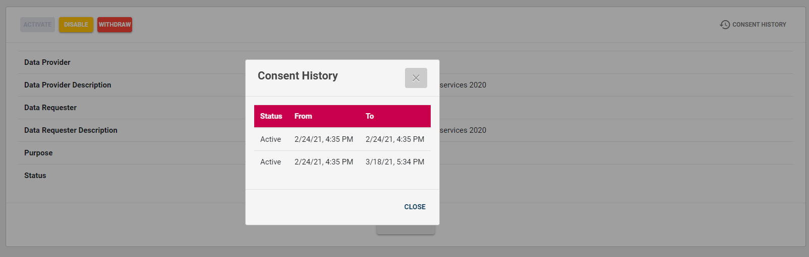

 ---
#### Consent Details

Expanding the Details accordion (image below) can be visualized further details on:

 - Processed personal data
 - With which Organization data can be shared
 - Data Controller details
 - Other info
 
 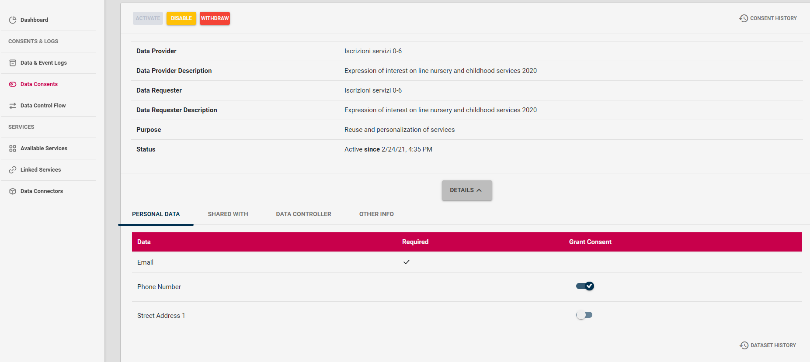

#### Personal Data control

In the **Personal Data** tab of Consent details accordion, End user can enable or disable each single Data Concept contained in the Resource Set regulated by that Consent.
This will involve the removal / addition of the specific concept from / in the Resource Set contained in that Consent Record. 

The popup shown by clicking **Dataset History** button (image below) will highlight all the transictions on controlled Data Concepts made by the user in time.

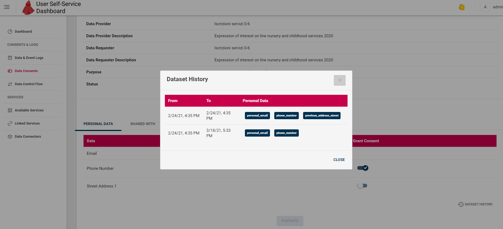

---
## Data & Events Logs section

This section shows to the End User the logs regarding Service Linking, Consenting or Data Request events, organized in a timeline.

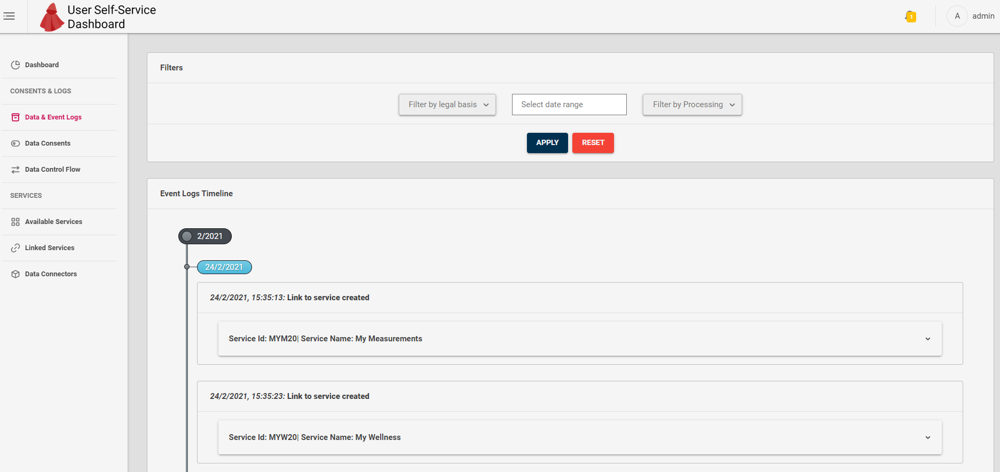
  
The Event logs can be filtered by:

 - **Legal Basis**
 - **Date range**
 - **Processing category**

---  