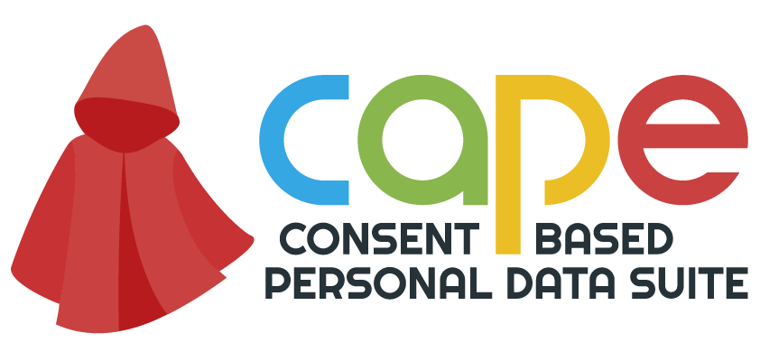

# CaPe - A Consent Based Personal Data Suite

CaPe is a consent-based and user-centric platform targeted at organizations acting as Data Processors, in the private or public sector.
It enables them to take advantage of the value of personal data in compliance with GDPR while providing data subjects the natural need to detain both the use and the protection on their own data.

CaPe acts as an intermediary and creates a communication channel between Data Subjects and Data Controllers.

CaPe is a software developed by
[Engineering Ingegneria Informatica SpA](http://www.eng.it) and supported by [EIT Digital](https://www.eitdigital.eu/).
