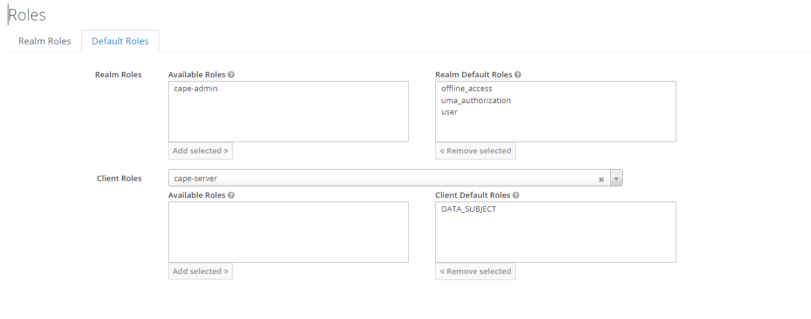
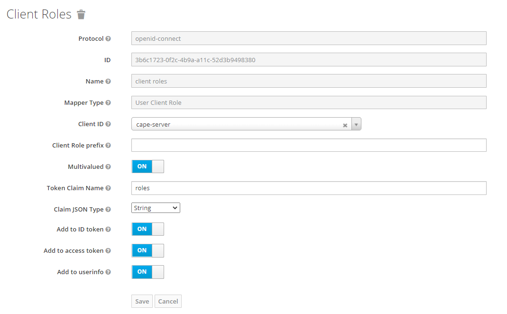

# Welcome to the CaPe Suite Installation Manual!

This section provides the description of the installation and administration functionalities. An
administrator should be able to install, deploy, perform the sanity checks on
the environment.

###Get the source code from repository

Open a command prompt and execute the following command to clone the source code
from the CaPe [GitHub](https://github.com/OPSILab/Cape.git) repository ([Git](https://git-scm.com/downloads) must be installed):

```bash
git clone https://github.com/OPSILab/Cape.git
```


```bash
cd Cape
```


---

### Install CaPe components
CaPe installation will involve the deployment of different architectural components, each of which can deployed either in a "on premise", "as a service" or mixed approach:

  - [**CaPe Server**](install-cape-server.md)
  - [**CaPe Dashboards**](install-cape-dashboards.md)
  - [**CaPe SDK**](install-cape-sdk.md)
           


---
## Libraries

CaPe Suite uses following libraries and frameworks (already included):

| Name                                                                                    | Version       | License                           |
|-----------------------------------------------------------------------------------------|---------------|-----------------------------------|
| [Spring Boot](https://spring.io/projects/spring-boot)                                   | 2.4.5 | Apache License 2.0                |
| [Springdoc Openapi](https://springdoc.org)                                              | 1.5.8        | Apache License 2.0                |
| [Spring Data](https://spring.io/projects/spring-data)                                   | 2.4.5 | Apache License 2.0                |
| [Nimbus Jose JWT](https://connect2id.com/products/nimbus-jose-jwt)                      | 8.5           | Apache License 2.0                |
| [Bouncy Castle](https://www.bouncycastle.org)                                           | 1.64          | MIT                               |
| [Lombok](Nihttps://projectlombok.org/)                                                  | 1.18.12       | MIT                               |
| [Apache Commong Lang 3](https://commons.apache.org)                                     | 3.11          | Apache License 2.0                |
| [JSONSchema2Pojo](http://jsonschema2pojo.org)                                           | 1.01          | Apache License 2.0                |
| [Angular](angular.io)                                                                   | 11.2.12        | MIT                               |
| [Nebular](https://akveo.github.io/nebular)                                              | 7.0.0         | MIT                               |
| [Json-Editor](https://github.com/json-editor/json-editor)                               | 2.3.0         | MIT                               |
| [Bootstrap](https://getbootstrap.com )                                                  | 4.6.0         | MIT                               |
| [Ngx-configure](https://github.com/catrielmuller/ngx-configure)                         | 9.0.0         | ISC License                       |
| [Ng2-smart-table](https://akveo.github.io/ng2-smart-table)                              | 1.7.2         | MIT                               |
| [Rxjs](https://rxjs.dev/guide/overview)                                                 | 6.6.7         | Apache License 2.0                |
| [Ngx-translate](http://www.ngx-translate.com/)                                          | 13.0.0        | MIT                               |
| [TypeScript](https://www.typescriptlang.org)                                            | 4.1.5         | Apache License 2.0                |
| [jQuery](jquery.com)                                                                    | 3.5.1         | MIT                               |
| [D3](https://d3js.org)                                                                  | 6.2.0         | BSD                               |
| [Material-design-icons](https://github.com/google/material-design-icons)                | 3.0.1         | Apache License 2.0                |
| [Fontawesome-free](https://fontawesome.com)                                             | 5.15.3        | CC-BY-4.0                         |
| [Fontawesome-svg-core](https://www.npmjs.com/package/@fortawesome/fontawesome-svg-core) | 1.2.35        | MIT                               |                                                                  |               |                                   |

---

<a name="identity-manager"></a>
## Identity and Access Manager

CaPe must interact with any Identity Manager that supports [OpenId Connect](https://openid.net/connect/) authorization framework.

**Note.** It is recommended to use [Keycloak Identity and Access Management](https://www.keycloak.org/), which will be used as reference for the configuration sections of this installation guide.

Cape Dashboards will use the Open Id Connect protocol upon the OAuth2 Authentication workflow (Authorization Code grant), in order to perform User authentication and obtain an Access Token (JWT), which will be used to grant access to Cape APIs.
This
 Access Token will be used by User and Data Controller Dashboards to call the Cape APIs exposed respectively by **Cape Server** and **Cape SDK Client** components.

In the same way, an external client application/service that wants to interact with Cape by using the Cape SDK APIs, must perform one of the available OAuth2 flows (Authorization Code, Client Credentials and Password grants) against the Cape 
Idm (e.g. Keycloak), in order to get an Access Token and then use it in the API requests.

### Keycloak Identity Manager installation
In order to get Keycloak ready to be used by Cape, following steps must be performed:

 - Install Keycloak, create a `Cape` realm and at least one user [(see here)](https://www.keycloak.org/getting-started/getting-started-docker).
 - Register two client applications with `cape-server` and `cape-service-sdk` and clientId [(see here)](https://www.keycloak.org/docs/latest/server_admin/#_clients). Be sure to select `public` in the Access Type field.
 - Create `DATA_SUBJECT` role in the `cape-server` client and `DATA_CONTROLLER` in the `cape-service-sdk` client. [(see here)](https://www.keycloak.org/docs/latest/server_admin/#client-roles).
 - Assign  `DATA_SUBJECT` as default role for `cape-server` client and `DATA_CONTROLLER` as default for `cape-service-sdk`. [(see here)](https://www.keycloak.org/docs/latest/server_admin/#_default_roles) and the image below.




 - Create for both clients a Mapper of type User Client Role and set `roles` as Token Claim Name, in order to map client roles to the `roles` field of the generated Access Token. (see the image below).




---

Any feedback on this documentation is highly welcome, including bug reports and
suggestions. Please send the feedback through
[GitHub](https://github.com/OPSILab/Cape). Thanks!

