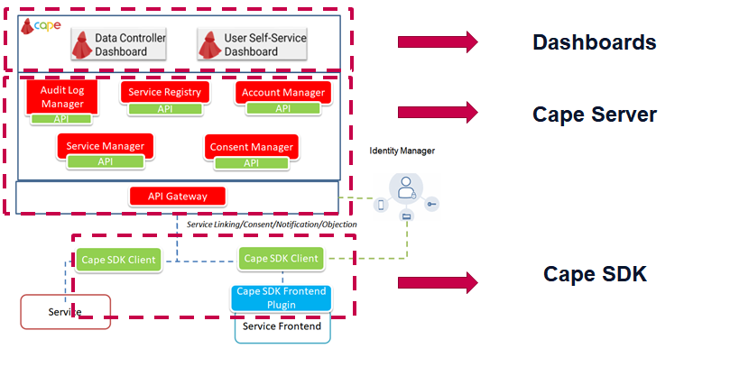

# Welcome to the CaPe Suite Installation Manual!

This section provides the description of the installation and administration functionalities. An
administrator should be able to install, deploy, perform the sanity checks on
the environment.

###Get the source code from repository

Open a command prompt and execute the following command to clone the source code
from the CaPe [GitHub](https://github.com/OPSILab/Cape.git) repository ([Git](https://git-scm.com/downloads) must be installed):

```bash
git clone https://github.com/OPSILab/Cape.git
```

Move into **`Cape`** folder:

```bash
cd Cape
```


---

### Install CaPe components
CaPe installation will involve the deployment of different architectural components, each of which can deployed either in a "on premise", "as a service" or mixed approach:

  - [**CaPe Server**](install-cape-server.md)
  - [**CaPe Dashboards**](install-cape-dashboards.md)
  - [**CaPe SDK**](install-cape-sdk.md)
           



---
## Libraries

CaPe Suite uses following libraries and frameworks (already included):

| Name                                                                                    | Version       | Licence                           |
|-----------------------------------------------------------------------------------------|---------------|-----------------------------------|
| [Spring Boot](https://spring.io/projects/spring-boot)                                   | 2.3.4.RELEASE | Apache License 2.0                |
| [Spring Cloud](https://spring.io/projects/spring-cloud)                                 | Hoxton.SR8    | Apache License 2.0                |
| [Springdoc Openapi](https://springdoc.org)                                              | 1.2.34        | Apache License 2.0                |
| [Spring Data](https://spring.io/projects/spring-data)                                   | 2.3.4.RELEASE | Apache License 2.0                |
| [Nimbus Jose JWT](https://connect2id.com/products/nimbus-jose-jwt)                      | 8.5           | Apache License 2.0                |
| [Bouncy Castle](https://www.bouncycastle.org)                                           | 1.64          | MIT                               |
| [Lombok](Nihttps://projectlombok.org/)                                                  | 1.18.12       | MIT                               |
| [Apache Commong Lang 3](https://commons.apache.org)                                     | 3.11          | Apache License 2.0                |
| [JSONSchema2Pojo](http://jsonschema2pojo.org)                                           | 1.01          | Apache License 2.0                |
| [Angular](angular.io)                                                                   | 11.2.0        | MIT                               |
| [Nebular](https://akveo.github.io/nebular)                                              | 7.0.0         | MIT                               |
| [Json-Editor](https://github.com/json-editor/json-editor)                               | 2.3.0         | MIT                               |
| [Bootstrap](https://getbootstrap.com )                                                  | 4.6.0         | MIT                               |
| [Ngx-configure](https://github.com/catrielmuller/ngx-configure)                         | 9.0.0         | ISC License                       |
| [Ng2-smart-table](https://akveo.github.io/ng2-smart-table)                              | 1.7.2         | MIT                               |
| [Rxjs](https://rxjs.dev/guide/overview)                                                 | 6.6.3         | Apache License 2.0                |
| [Ngx-translate](http://www.ngx-translate.com/)                                          | 13.0.0        | MIT                               |
| [TypeScript](https://www.typescriptlang.org)                                            | 4.1.5         | Apache License 2.0                |
| [jQuery](jquery.com)                                                                    | 3.5.1         | MIT                               |
| [D3](https://d3js.org)                                                                  | 6.2.0         | BSD                               |
| [Material-design-icons](https://github.com/google/material-design-icons)                | 3.0.1         | Apache License 2.0                |
| [Fontawesome-free](https://fontawesome.com)                                             | 5.14.0        | CC-BY-4.0                         |
| [Fontawesome-svg-core](https://www.npmjs.com/package/@fortawesome/fontawesome-svg-core) | 1.2.30        | MIT                               |                                                                  |               |                                   |

---
## External Components

CaPe uses [Fiware Keyrock](https://fiware-idm.readthedocs.io/en/latest/) as IdM.

---

Any feedback on this documentation is highly welcome, including bug reports and
suggestions. Please send the feedback through
[GitHub](https://github.com/OPSILab/Cape). Thanks!

