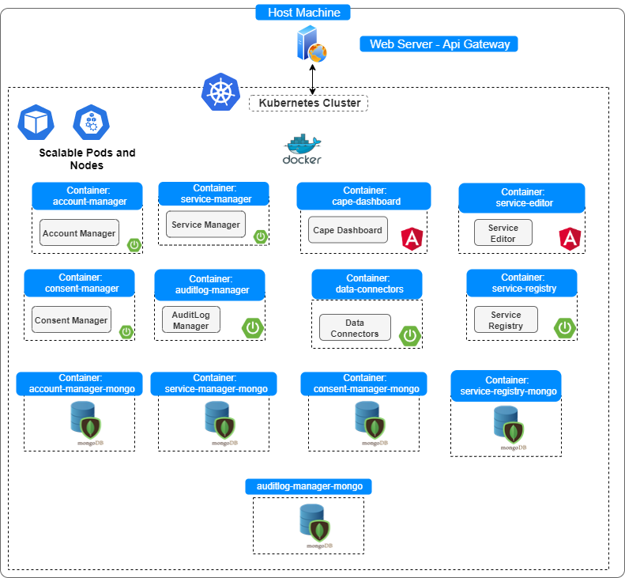

# Installing CaPe Server - Docker

This document describes how to install and launch CaPe Server very easily
using [Docker](https://www.docker.com/) and [Docker-Compose](https://docs.docker.com/compose/).

All the CaPe Server components will be deployed as Docker containers (based on Tomcat Alpine image and each of paired with a MongoDB container) running in the same Docker network (in order to resolve automatically their hostnames).

Altough this can be accomplished by building and running each container, is **recommended** to use directly the provided **docker-compose.yml** file, 
which allows you to start the whole stack by pulling already built images published on [Capesuite Docker Hub repository](https://hub.docker.com/search?q=capesuite&type=image).

CaPe Server folder provides both **DockerFile** files (in each subfolder) and  the **docker-compose** file, in order to use both methods.


**NOTE**. Soon will be provided a deployment.yml file in order to support Kubernets based deployments. The roadmap is to use an API Gateway based approach, as described in the image below.



---
## Prerequisites

You must install of course:

   -  **Docker Engine**: version >= 20.10 ([see the guide](https://docs.docker.com/get-docker/)).
   -  **Docker Compose**: ([see the guide](https://docs.docker.com/compose/install/#install-compose)).

## Start it up with Docker Compose

Docker Compose allows to run the whole stack and to link each component to the other under the same Docker network.

In order to accomplish this:

  - Move into **Cape/cape-server** folder
  
  - Before launching docker-compose.yml, modify it to configure environment variables properly, as
    described below.
	
     (**ONLY AFTER COMPLETING FOLLOWING CONFIGURATION SECTION**) 
	 
	 Run the docker-compose file with:

```bash
docker-compose up
```

The containers will be automatically started and attached to the created `cape-network` network (see below).

---
## Configuration

### Docker networking

All the Cape Server containers will be attached to the same Docker network and each one will have its own assigned IP and
hostname, internal to the network. In particular, the container hostname will be
equal to the name given in the “services” section of docker-compose file and each will expose its APIs in the published port given in the "ports" section. Thus,
each container can look up the hostname of the others.


You can check the created network (after running "docker-compose up"), where all the containers will be attached to,
with:

```bash
docker network ls
```

Once the application was started, you can check IPs assigned to running
containers, with:

```bash
docker inspect network cape-network.
```


**NOTE**.
As the network is a bridge, each port exposed by containers (e.g. 8080), will be
mapped and also reachable in the machine where Docker was installed. Thus, if
the machine is publicly and directly exposed, also these ports will be
reachable, unless they were closed.

### Configuration through environment variables


**IMPORTANT Note.**.
The properties in each components's `application.properties` file (see [WAR packaging installation](install-cape-server-war.md))
are defined following Spring notation **property=`${ENVVARIABLE_NAME:value}`**. 

Every `ENVVARIABLE_NAME` defined in `environment` sections of each container  will overwrite 
the default `value` defined in the properties file. 

As other configuration (see next sections) relies on docker networking lookup, the only environment variables to be modified is:

 - **`CAPE_IDM_ISSUER_URI`**: with the JWT Issuer Uri of installed Idm (e.g. `https://IDM_HOST/auth/realms/Cape`)


**Note**. This endpoint will be used to verify token issued for the Oauth2 client application `cape-server` registered during Idm/Keycloak installation [(see this section)](./index.md#identity-manager).

**Note.** Change **IDM_HOST** with the real hostname where IdM (e.g. Keycloak) has been deployed.


#### CORS Configuration

If the User Self-Service Dashboard is going to be deployed in a different domain (e.g. http://localhost) than the one of Cape Server components (e.g. https://www.cape-suite.eu), modify one of the following environment variable appropriately:

  - **CAPE_IDM_ALLOWED_ORIGIN_PATTERNS**
  - **CAPE_IDM_ALLOWED_ORIGINS**

in order to correctly enable CORS requests between the Dashboard and Cape Server APIs.

#### Inter-component communication variables (keep untouched by default)

Following environment variables let to connect a component container to the others. 
Values MUST follow corresponding `ports` configuration on the other containers, by default it is recommended to do not modify them.

Example:

  - **`CAPE_SERVICE_MANAGER_URL`**: default value http://service-manager:8082/service-manager (as service-manager's *ports* section in set with 8082:8080)
  - **`CAPE_AUDITLOG_MANAGER_URL`**: default value http://auditlog-manager:8081/auditlog-manager (as auditlog-manager *ports* section in set with 8081:8080)
  - **`CAPE_SERVICE_REGISTRY_URL`**: default value http://service-registry:8088/service-registry (as service-registry *ports* section in set with 8088:8080)
  - **`CAPE_CONSENT_MANAGER_URL`**: default value http://consent-manager:8083/consent-manager (as consent-manager *ports* section in set with 8083:8080)


Following properties will depend on paired MongoDB container configuration (keep untouched by default):

Example:

  - **`CAPE_ACCOUNT_MANAGER_MONGODB_HOST`**: **account-manager-mongo** (as paired XXX-mongo container is named as "account-manager-mongo")
  - **`CAPE_ACCOUNT_MANAGER_MONGODB_PORT`**: **27017** (as paired XXX-mongo container has *ports* section set with 27017:27017)
  - **`CAPE_ACCOUNT_MANAGER_MONGODB_USER`**: **root** (as paired XXX-mongo container has **`MONGO_INITDB_ROOT_USERNAME`** set with root)
  - **`CAPE_ACCOUNT_MANAGER_MONGODB_PWD`**:  **root** (as paired XXX-mongo container has **`MONGO_INITDB_ROOT_PASSWORD`** set with **root**)

Similar approach applies to the other component's containers.

---
## Applying configuration

Once all the environment configurations are done, we can run:

```bash
docker-compose up
```

As a result of this command, Cape Server components will listen on several ports (as defined in each `ports` section).

---