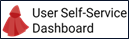

# Installing CaPe User Self-Service Dashboard


<span style="display:block;text-align:center">
</span>

This section covers the steps needed to properly install CaPe User Self-Service Dashboard. 
It is a Angular portal based on Nebular framework that can be installed in the following ways:

-   Build as Angular distribution and deploy natively on a Web Server
-   Run as Docker containerized environment (recommended)


The following sections describe each installation method in detail.

---
## Install natively on Web Server

Build Angular application and deploy compiled folder on a Web Server.

### Requirements

In order to install Data Controller Dashboard followings must be correctly installed and
configured:

| Framework                                                                                                      | Version                | Licence                                 |
| -------------------------------------------------------------------------------------------------------------- | ---------------------- |---------------------------------------- |
| [NodeJS with NPM](https://nodejs.org/en/)                                                                      | >=14.15                | MIT                                     |
| [Apache](https://httpd.apache.org) or [Nginx](https://nginx.org/en) Web server                                 | 2.4.43 / 1.18.0        | Apache License v.2.0 /  2-clause BSD    |

&nbsp;
### Build Angular Application

Execute the following commands to create the dist folder.

-  Move into `cape-dashboard/` folder:

```bash
cd cape-dashboard
```

- Run following commands:

```bash
npm install
```

```bash
npm run build:prod
```

- The application files will be compiled into `dist` folder


### Deployment and Configuration

#### Dist folder deployment

Move the files in `dist` subfolder to a new folder on the Web server document root (e.g. `/var/www/html` for Apache and `/usr/share/nginx/html` for Nginx.

#### Configuration

Once the dist folder files are deployed and the server has started, modify the
fields of `config.json` configuration file, located in `dist/assets/` folder.
(These modifications can be made also in `cape-dashboard/src/assets/config.json` file before building the Application, as described in the section above).


- **`serviceRegistry.url`**: with endpoint (**`host`:`port`**) where Service Registry component of Cape Server is listening:


```
{
  "serviceRegistry": {
	"url": "http://localhost:8088/service-registry/api/v2"
  }
...
```  
 
- **`system.operatorId`**: with Operator Id created for Operator Description managed with Service Manager (see [Cape Server - Service Manager APIs](install-cape-sdk-client.md)

```  
  "system": {
    "operatorId": "http://localhost:8085/cape-service-sdk/api/v2",
``` 


- **`system.dashboardUrl`**: with endpoint (**`host`:`port`**) where User Self-Service Dashboard is running (depends on Web server configuration or if running with Docker on different published port).

```   
    "serviceEditorUrl": "http://localhost/cape-dashboard",
```   


- **`system.accountUrl`**: with **PUBLIC** (as the Dashboard will make HTTP calls from frontend running locally on browser) endpoint (**`host`:`port`/api/v2**) where Cape Server Account Manager is listening (see [Cape Server installation](install-cape-server.md)

```  
    "accountUrl": "http://localhost:8080/account-manager/api/v2",
``` 

- **`system.serviceManagerUrl`**: with **PUBLIC** (as the Dashboard will make HTTP calls from frontend running locally on browser) endpoint (**`host`:`port`/api/v2**) where Cape Server Service Manager is listening (see [Cape Server installation](install-cape-server.md)

```  
    "serviceManagerUrl": "http://localhost:8082/service-manager/api/v2",
``` 

- **`system.auditLogUrl`**: with **PUBLIC** (as the Dashboard will make HTTP calls from frontend running locally on browser) endpoint (**`host`:`port`/api/v2**) where Cape Server Auditlog Manager is listening (see [Cape Server installation](install-cape-server.md)

```  
    "auditLogUrl": "http://localhost:8081/auditlog-manager/api/v2",
``` 

- **`system.consentManagerUrl`**: with **PUBLIC** (as the Dashboard will make HTTP calls from frontend running locally on browser) endpoint (**`host`:`port`/api/v2**) where Cape Server Consent Manager is listening (see [Cape Server installation](install-cape-server.md)

```  
    "consentManagerUrl": "http://localhost:8083/consent-manager/api/v2",
``` 
- **`i18n.locale`**: with locale (`it`, `en` allowed) enabling internazionalization on Dashboard pages. 

```
  },
  "i18n": {
    "locale": "en" 
  }
}
```

##### IDM Configuration for OAuth2 authentication

CaPe User Dashboard uses the Oauth2 Client Credentials flow (without client secret at moment, soon PKCE will be implemented) to perform authentication and get User information from claims of the issued JWT (in particular the email will be used to create a Cape Account on first login).

In order to correctly execute the OAuth2 flow, CaPe User Self-Service Dashboard will act as the `cape-server` client application previously registered in the IdM (Keycloak):

- Configure correctly the Valid Redirect URIs section [see here](https://www.keycloak.org/docs/latest/server_admin/#_clients) with.:
  
    * **`http://localhost/cape-dashboard/login/*`**

- If the Dashboard is going to be deployed in a different domain (e.g. http://localhost) than the Keycloak one (e.g. https://www.cape-suite.eu), configure the Web Origins section accordingly, in order to correctly enable CORS requests between the Dashboard and Keycloak.
  
**Note**. Replace `http://localhost` with the real hostname (include http(s) protocol) where the Dashboard is deployed and accessible from browser.


- Change following fields in `src/assets/config.json` file:

    * **`system.auth.idmHost`** with endpoint (**`protocol://host`:`port`**) where IdM has been deployed.
  
    * **`system.auth.clientId`** with Client Id (`cape-server`) provided by application registration in the Idm.


**Note**. Similar configurations and approach can be applied for any other IdM capable of OAuth2 functionalities.

**SOON** will be used also environment variables in order to ease the configuration in case of installation with Docker.

---
## Install with Docker-compose

Data User Self-Service Dashboard can be run as Docker container (based on Nginx image), by using the provided `docker-compose.yml` file.

### Prerequisites

You must install of course:

   -  **Docker Engine**: version >= 20.10 ([see the guide](https://docs.docker.com/get-docker/)).
   -  **Docker Compose**: ([see the guide](https://docs.docker.com/compose/install/#install-compose)).


### Configuration

The provided `docker-compose.yml` file has also directives to mount the provided `nginx.conf` file, needed to correctly handle deep-linking on deployed Dashboard Angular application.

It contains also the mount to the `src/assets/config.json` file, which allows to configure the Dashboard as described in the [Deployment and Configuration](#deployment-and-configuration) section.

**SOON.** Will be available configuration with environment variables to be set directly in `environment` section of `docker-compose.yml` file.

### Start it up with Docker Compose

Docker Compose allows to run the Docker container by pulling the already built image from [Cape Docker Hub repository]().

In order to accomplish this:

- Move into **`Cape/cape-dasboard`** folder.
  
- Ensure you modified `config.json` file properly, as described in the section above.
	
- Run the docker-compose file with:

```bash
docker-compose up
```

The containers will be automatically started and attached to the created `cape-network` network.

---
## Launch and Learn

The Data User Self-Service Dashboard is available to the endpoint according to installation mode (Web server or Docker).

Open your favourite browser and point to that endpoint.

Go to [User Self-Service Dashboard Manual](../dashboards/user-dashboard/index.md) section to learn how to use the Dashboard.

