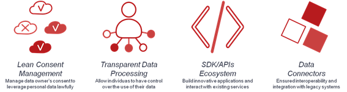
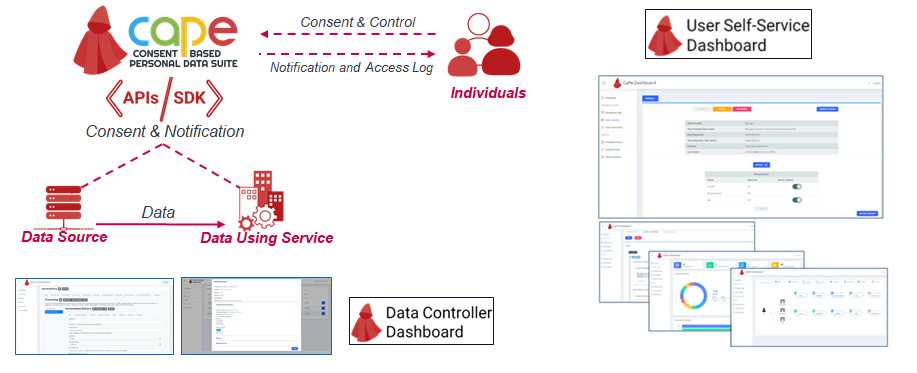

# CaPe - A Consent Based Personal Data Suite - Introduction

CaPe supports public and private companies at every stage of the acquisition and consent management process and at the same time provides data subjects with a simple way to grant and withdraw consent to the use or sharing of personal data within an ecosystem of inter or cross organizational digital services and check at any time: what data is shared, with whom, for what purpose and how they are processed.
CaPe follows several initiatives, standards and regulations.
In particular, CaPe addresses legal requirements towards the new EU GDPR (General Data Protection Regulation):

 * Consent-based data management,
 * Technical means to verify compliance with data handling prescriptions,
 * Right to have a copy of personal data,
 * Right to be forgotten,
 * Transparency tools on data usage.

CaPe follows MyData Architecture Framework that aims to provide a standard for implementations that satisfy the legal requirements for processing of personal data and provide transparency to individuals about how their data is being used.
In order to provide a solution for personal data management among public services it is important assure interoperability for an easier information processing. CaPe service description is based on ISA2  Common Public Service Vocabulary Application Profile (CPSV-AP). Public administrations and service providers can use this model to guarantee a degree of cross-domain and cross-border semantic interoperability between public service catalogues and CaPe solution.
To support interoperability CaPe integrates and extends Fiware GEs solution for data source integration, data models, access policies enforcements and identity management(IDM).
CaPe is a suite of tools and services providing:

  *	Lean Consent Management – to manage data owner’s consent to leverage personal data lawfully
  *	Transparent Data Processing – to allow individuals to have control over the use and sharing of their data
  *	SDK/APIs Ecosystem – to build innovative applications and interact with existing services
  *	Data Connectors – to ensure interoperability and integration with legacy systems

	

CaPe acts as an intermediary and as a tool of communication between data subjects and controllers/processors, supporting the entire  end-to-end process of generation and management of dynamic consents. 
Individual authorize the flow of his or her data with consent, receive notifications and can view access logs on the use of data. In the general scenario of data sharing and processing we can have involved both Data Sources and Data Using Services. 
Data Source provides data about individual to the services that use this data (Data Using Service).

	

Of particular importance on data sharing processes is the ability to grant and withdraw consent to third parties for access to data about oneself. Consent authorizes Data Sources to provision data to Data Consumer and authorizes Data Requester to process that data. Consent has to refer to a Data Usage Policy that can be linked to consent formalization.
Consent need to be given in a clear manner so that the data controller can demonstrate that a valid consent has been given. Consent record should demonstrate:

 * Who consented
 * When they consented
 * What  was consented
 * How was consented
 * Whether a consent withdrawn occurred

CaPe supports two types of consenting:

 * consenting to processing within a service for a specific purpose
 * consenting to sharing data from a service (Source) to be processed in another service (Sink) for a specific purpose.

CaPe tools enable data processor to provide the individuals notifications about and means to object data processing not requiring their consent and to provide transparency to individuals about how their data is being used. In particular CaPe “User Dashboard” has the goal to manage and control “personal data ” during the interaction with real life services (PA, Social, IoT, B2x) .By means of CaPe Dashboard Data Owner has a single point to verify which data are used, and how and for which purpose.
