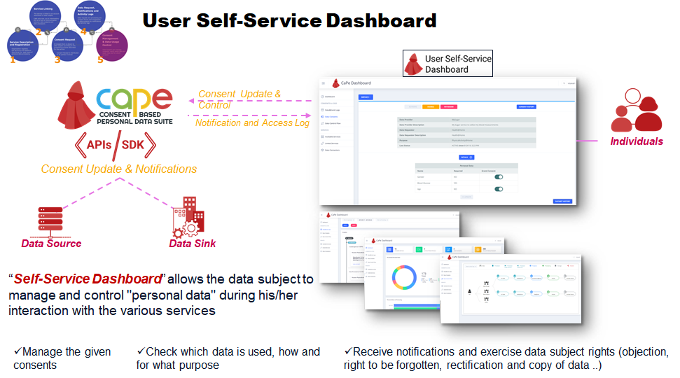

# 5. Consent Management

CaPe End Users can manage the overall lifecycle of their own Data Usage Consents by interacting with CaPe User Self-Service Dashboard (see [User Dashboard section]()).

#Data Usage Control

Service processing data or Source Service providing data to Sink, relying on Consent Enforcement and Data Transfer previously described,
can deliver Data Usage Control.

The Consent Record structure enables further explicit Usage Control enforcement, by using rule derived by such structure. (e.g. ODRL).
The target is to ensure​ ​that​ ​the​ ​potential​ ​constraints​ ​set​ ​in​ ​Consent​ ​Records​ ​are​ ​not​ ​violated.
Soon will be implemented translation of created Consent Records into ODRL rule sets, to be used in Policy Enforcement Point based architectures.
