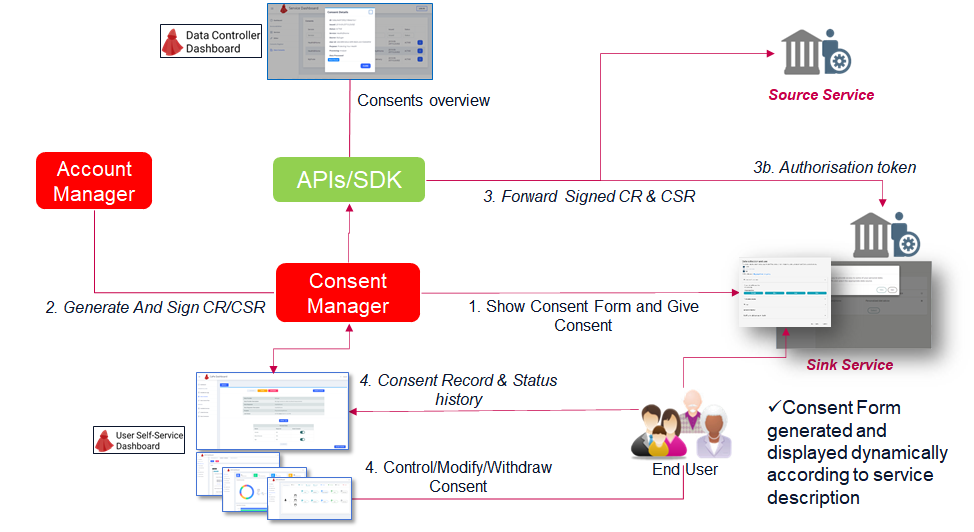
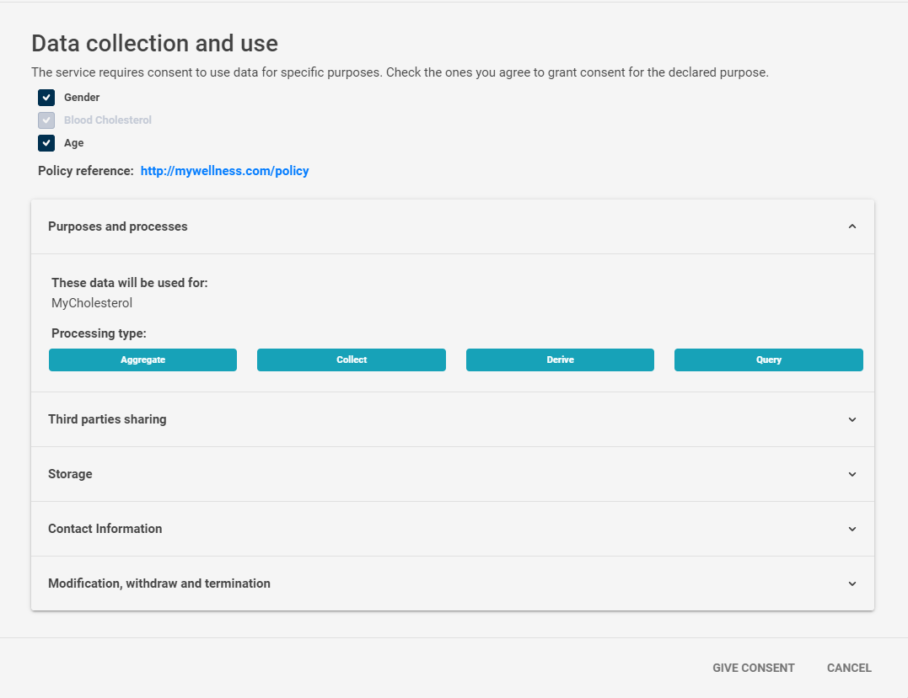

# 3. Consent Form and Consent Request

After​ ​a​ ​service​ ​has​ ​been​ ​linked​ ​to a Cape Account,​ ​the​ ​service​ ​can​ ​be​ ​authorised​ ​to​ ​process​ ​data​ ​by conducting​ the ​Consenting​ ​phase.
This process always starts when the user either accesses the service for the first time or the processing conditions for that specific purpose have changed.

CaPe supports two types of consent: 

 - **Within a service**: Consent is required for processing of data within a single service itself, for different purposes for which personal data have been obtained and if it optionally will share them with other companies/services for the declared purposes.
                         The generated Consent will have the **Resource Set**, containing the datasets with data concepts being object of each specific processing purpose.
 
 - **Sharing between services**: Consent is required for the explicit sharing of personal data between data sources (Source) and data using services (Sink), for a specific processing purpose. 
								 After​ ​a​ ​Source​ ​and​ ​a​ ​Sink​ ​have​ ​been​ ​linked​ to CaPe Account,​ ​the​ ​Sink​ ​can​ ​be​ ​authorised​ ​to​ ​access data​ ​on​ ​the​ ​Source​ ​by​ ​conducting​ ​a​ ​two-party​ ​Consenting​ ​step.​ ​The​ ​step​ ​results​ ​in​ ​a​ ​pair​ ​of​ ​Consent Records.
                                 The Consent pair will have also in this case the **Resource Set**, but containing datasets matchin with the intersection between datasets provided by Sink and Source descriptions.

---
## Key concepts

Followings are the key concepts of this phase in CaPe workflow:

  - **Consent Record (CR)**: is the outcome of the Consenting phase, it ​​documents​ ​the​ ​permission​ ​the End User​ (Data Subject)​ ​has​ ​granted​ ​to​ ​a​ ​specific
    service for a specific processing purpose.​  It contains all the policies informatcion about the data processing type, purpose category, datasets involved (Resource Set), sharing with third parties, storage, etc.
	Service’s​ ​service description​ ​contains​ ​a​ ​description​ ​of​ ​all​ ​data​ ​a​ ​service​ ​can​ ​provision​ ​or​ ​process.
	End User creates​ ​(through​ CaPe)​ ​a​ ​**Resource​ ​Set**​ ​while​ ​creating​ ​a​ ​consent​ ​by​ ​selecting​ ​a set​ ​of​ ​data​ ​for​ ​processing (depending on purposes defined by the Service).
	
	**Note.** The Processing Bases (purposes) described in the Services Description will be used in the Consenting phase to create the **Usage Rules** associated to the given Consent Record. 
	In this way the Consent will indicate which data (**Resource Set**) and how will be used (**Processing Bases into Usage Rules**).
	
	CR is an immutable record, signed with the Cape User Account's private key, according to [IETF Json Web Signature(JWS) specification](https://tools.ietf.org/html/rfc7515).
	
         The​ ​JWS​ ​header​ ​MUST​ ​contain​ ​‘kid’​ ​field​ ​identifying​ Cape User Account's ​key​ ​pair​ ​used​ ​to​ ​sign​ ​the
         Consent​ ​Status​ ​Record.    

    Consent Records​ ​are​ ​stored both​ ​in​ ​the​ ​Consent Manager​ ​and​ ​in​ ​the​ ​service:

     - In the "within​ ​a​ ​service" case,​ ​CaPe ​creates​ ​a​ ​single​ ​Consent Record​ ​for​ ​the​ ​related​ ​service.​ 
	 
	 - In the "sharing between services", CaPe creates​ ​a​ **​pair​ ​of​ ​Consent​ ​Records**​ ​(one​ ​for​ ​the​ ​Source​ ​and
       one​ ​for​ ​the​ ​Sink).​ ​The​ ​Source’s​ ​CR​ ​defines​ ​what​ ​data​ ​can​ ​be​ ​provisioned​ ​to​ ​the​ ​specified​ ​Sink,​ ​and
       the​ ​Sink’s​ ​CR​ ​defines​ ​how​ ​the​ ​data​ ​can​ ​be​ ​accessed. 

     **Note**. CR will have a Common Part and (in case of Consent pair) a Role Specific part (Source/Sink).
	 
  - **Consent Status Record (CSR)**: the status of the consent is indicated by a separate record.​ It ​​is​ ​a​n ​immutable, timestamped, signed record that CaPe​ ​sends​ ​to​ ​a​ ​service​ ​when ​a Consent​ status ​changes.
    This is the dinamic part of the CR, contained in a related list which represents the CR status history.
    ​Service​ ​MUST​ ​store​ ​these​ ​records​ ​for​ ​future​ ​use (through the CaPe SDK).
 
	CR's have three valid states:
     
	 - *Active​*: End User's data can be processed according to rules set in consent
	 - *Disabled*: Data processing is temporarily not allowed
	 - *Withdrawn*: Data processing is permanently not allowed
	 
	 When​ ​issued,​ ​CR​ ​is​ ​in​ ​​Active​ ​state.​ ​End User​ ​can​ ​also​ ​withdraw​ ​CR​ ​(from​ ​any​ ​other​ ​state)​ ​at
     will​ ​by​ ​setting​ ​its​ ​state​ ​to​ ​​Withdrawn​.​ ​A​ ​withdrawn​ ​consent​ ​cannot​ ​be​ ​reactivated,​ ​a​ ​new​ ​consent​ ​must
     be​ ​created​.
	 
	 **Note** If Service Link relative to the Service involved in the consents is removed, CaPe sets automatically all those consents in the disabled state. ​ 

 ---
 
 
 
The Figure above depicts the steps involved in the consenting phase of CaPe workflow:

 1. End User is logged in the Service for which wants to consent data processing for a specific purpose.
	
	- He/She views the Consent Form dinamically generated by Cape relying on the processing purpose and details (processing categories, legal basis, resource set, etc.) described during service description phase.

	  
    - Selects/deselect optional data and visualizes required data and policies for processing. 
	- He/She gives the consent by submitting the Consent Form (shown below).
     

     **Note**. Consent Form are stored for further notarization (SOON implementation).

 2. CaPe (Consent Manager & Account Manager) creates the signed JWSs representing the Consent Record (**CR**) and the first Consent Status Record (**CSR**, set to active), in detail:
    
	 - 2a. The partial JWS payloads of CR and CSR are initializiated by Consent Manager.
	 - 2b. CR and CSR payloads are signed by Account Manager with User's account private key (RSA). 

 3. Copies of CR and CSR are forwarded and stored to the service(s) through the SDK APIs.
    Services​ ​MUST​ ​verify​ ​the​ ​signature​ ​of​ ​the​ ​CSR​ ​and​ ​reject​ ​status​ ​changes​ ​that​ ​are​ ​not​ ​signed​ ​with​ ​one of​ ​the​ ​keys​ ​contained​ ​in the relative​ ​Service​ ​Link​ ​Record.
	
	  - **OPTIONAL** Further notarization of the CR and CSR can be made by sending their signatures towards an external Notarization system (e.g. blockchain based hashing).
	  - In​​ ​the​ ​sharing between services case, ​Sink service ​can​ ​then​ ​request​ ​the​ ​**Authorisation​ ​Token**​ ​from​ ​CaPe​ ​before​ ​a​ ​data​ ​request​ ​can​ ​take​ ​place.
	    This token is signed by CaPe (Service Manager) with its private Operator Key.
  
  
 4. CR and CSR are saved in CaPe and the related Consent is shown as active in the CaPe User Dashboard. 
    End User through the User Self-Service Dashboard can:
	- 4a. View all Consents details, status history, datasets history, etc.
	- 4b. Manage all his/her Consents status, enable/disable/revoke the consent or modify the conditions (e.g. add/remove one or more optional data from Consent's Resource Set).

