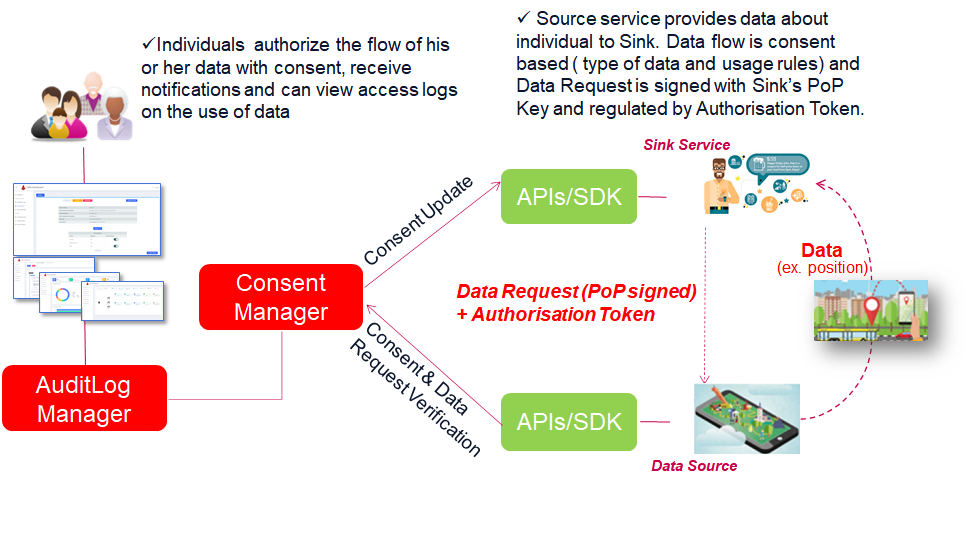

# 4. Data Request

Once the Consent has been given for a specific linked Service or Sink/Source services pair, the data processing/data transfer request can take place and will be regulated by Cape's Consent enforcement.
In particular:

  - **Within service case**: Service will process End User's data according to status, rules and policies defined in its related Consent Record.

  - **Sharing between services**: Both​ ​Source​ ​and Sink​ ​have​ ​their​ ​own​ ​Consent​ ​Record,​ ​which​ ​contains​ ​role​ ​specific​ ​information​ ​necessary​ ​in
                                  establishing​ ​a​ ​Data​ ​Connection​ ​between​ ​Source​ ​and​ ​Sink.

---
## Consent Enforcement

Consent Record​ ​MUST​ ​be​ ​validated​ ​every​ ​time​​ ​the​ ​data​ ​is​ ​processed​ ​based​ ​on​ ​the​ ​consent.
It will use Cape SDK API's to either directly verify or update its local Consent Status (CR/CSR),
in order to check that processing being executed on personal data complies with End User's willings described in the Consent.

Consent​ ​is​ ​valid​ ​if:

  1. Time​ ​of​ ​use​ ​is​ ​between​ ​not​ ​before​ ​and​ ​not​ ​after​ ​timestamps;​
  2. Consent​ ​status​ ​in​ ​latest​ ​Consent​ ​Status​ ​Record​ ​is​ ​Active.
---
## Data Transfer

In addition to Consent Record enforcement, in the case of sharing between services, Sink will send to Source the actual data transfer request, in order to retrieve from it the datasets defined in Consent Record.

### Authorisation Token

​Authorisation​ ​Token​ ​is​ ​an​ cryptographically​ ​signed​ ​proof-of-possession token​ ​given​ ​to​ ​Sink​ ​and​ ​expressed​​ ​in​ ​the​ ​JSON​ ​Web​ ​Token​ ​(JWT)​ ​format​ ​as​ ​described​ ​in​ ​[RFC7519 specification](https://tools.ietf.org/html/rfc7519).

**Sink service will receive this token in the Consenting phase and use ​in​ ​data​ ​request​ ​to​ ​refer​ ​to​ ​a​ ​specific​ ​consent.**
If​ ​Sink​ ​does​ ​not​ ​have​ ​an​ ​Authorisation​ ​Token​ ​or​ ​the​ ​token​ ​has​ ​expired,​ ​Sink​ ​MUST​ ​request​ ​a​ ​new token​ ​before​ ​making​ ​a​ ​data​ ​request.​

---

The figure above depicts the data transfer, consent based flow, which involves following steps:

  - Sink​ ​requesting​ ​data​ ​based​ ​on​ associated consent ​MUST​ ​ensure​ ​that​ ​Consent​ ​Record​ ​is​ ​Active,​ ​the​ ​intended
    use​ ​of​ ​data​ ​is​ ​listed​ ​in​ ​Consent​ ​Record’s​ ​purposes​ ​and​ ​that​ ​the​ ​request​ ​is​ ​made​ ​to​ ​protected
    resource​ (dataset) ​listed​ ​in​ ​Consent​ ​Record’s​ Resource Set.

  - Sink creates the **Data Transfer Request**, which contains:

     - **`Surrogate Id`** of the Service Link Record associated to Sink Service and CaPe's User Account
	 - **`Consent Record Id`** of the Consent Record issued to Sink Service.
     - **`Resource Set Id`** of the Resource Set contained in the CR.
     - **`Dataset Id`** of the Dataset contained in the Resource Set.
     - **`Authorisation Token`** issued by Cape during Consenting phase (signed with private `Operator Key`).

  - Sink signs the Data Transfer Request above with private part of its **`PoP Key`** (created during Service Linking phase) and sends it to the Source Service.
    The signature is included as `Authorization: PoP` header (see [IETF specification](https://tools.ietf.org/html/draft-ietf-oauth-signed-http-request-03)).

  - In order to grant access to requested resources, Source service will perform following validation steps:
  
    - **`Data Request`**: Verify data request signature (`Authorization: PoP` header) with the public part of **PoP Key**, retrieved from **Role Specific** part of the Source's Consent Record (*pop_key* field).
    
	- **`Authorisation Token`**: Verify Authorisation Token signature with public part of Operator Key, retrieved from **Role Specific** part of the Source's Consent Record (*token_issuer_key* field).

    - **`Consent Record Id`, `Resource Set` & `Dataset Id`**: Check matching Consent Record is active and the request is for a dataset listed in the CR's Resource Set.
	   
	     - Check if exists active paired Consent Record for input Cr Id and Surrogate Id (latest CSR in Active status).
         - Resource Set in the matching CR matches with input Resource Set Id.
         - Dataset in the matching Resouce Set matches with input Dataset Id.

   - ​​Based​ ​on​ ​the​ ​validation​ ​process​ ​conducted​ ​by​ ​Source,​ ​Sink​ ​either​ ​receives​ ​the​ ​data​ ​it
     requested​ ​or​ ​receives​ ​an​ ​error​ ​message. 

For further information see [Data Transfer Apiary section]().

# Notifications & Activity Logs

All notifications will be tracked by CaPe as Event Logs that can be viewed both by the Data Subject (via Use Self-Service dashboard) and by the Service Provider (via Data Controller dashboard).
All the aforementioned phases and those relating to the request and processing of data are tracked by CaPe through a taxonomy of events that will be saved by CaPe (AuditLog Manager).

**Note**. Soon will be supported also asynchronous notifications both for End User and Service Provider via email, phone and other channels.

For further information see [Dashboards section]().

