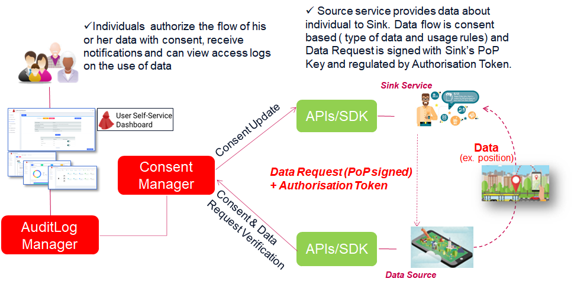

# 4. Data Request

Once the Consent has been given for a specific linked Service or Sink/Source services pair, the data processing/data transfer request can take place and will be regulated by Cape's Consent enforcement.
In particular:

  - **Within service case**: Service will process End User's personal data according to status, rules and policies defined in the related Consent Record issued by End User consenting phase.

  - **Sharing between services**: Both​ ​Source​ ​and Sink​ ​have​ ​their​ ​own​ ​Consent​ ​Record,​ ​which​ ​contains​ ​role​ ​specific​ ​information​ ​necessary​ ​in establishing​ ​a​ ​Data​ ​Connection​ ​between​ ​Source​ and​ ​Sink.

# How to enforce Consent Record?
Enforcement of an issued Consent Record can be accomplished by integrated Service by interacting with Cape SDK APIs, according to increasing steps of interaction with Cape capabilites and complexity:

- **Consent Enforcement**
- **Usage Rules Enforcement with input Data Payload**
- **Data Request**

**Note**. Following sections will provide an overview of each case with pros/cons that will ease the right choice for you. See Api documentation and API walktrough for further details.

---
## Consent Enforcement

Consent Record​ ​MUST​ ​be​ ​validated​ ​every​ ​time​​ ​data​ ​is​ ​processed​ ​based​ ​on​ ​the​ ​consent.
Service processing End User personal data and being part of a Consent issued by the user itself, will use **Consent Record APIs** of Cape SDK to verify the existence of that Consent Record for the specific User and Dataset being processed and its relative Consent Status (either against its local copy or directly at Cape Server), in order to check that processing being executed on personal data complies with End User's willings described in the Consent itself.

### Considerations

With this level of interaction, Cape is responsible only of issuing signed Consent Records. In this way Cape does not guarantee that the data is actually processed according to the held consent, but only guarantees the integrity of Consent Record. It is up to the specific Service implementation to check that the retrieved Consent Record is valid before proccessing related End User personal Data.

Consent​ ​can be considered ​valid​ ​if:

  1. Its Resource Set contains the dataset being processed.
  1. Current timestamp ​is​ ​between​ its `​not​ ​before` (nbf)​ ​and​ `​not​ ​after` (exp)​ ​timestamps;.
  2. Consent​ ​Status​ ​in​ ​latest​ ​Consent​ ​Status​ ​Record​ ​is​ ​Active.

---
## Usage Rules Enforcement

Relying on held Consent Records, Cape is capable of generating related Usage Rules that will use internally to filter input Data Payloads.
Service processing End User personal data and being part of a Consent issued by the User itself, will use **Enforcement API** of Cape SDK to issue Data payloads (Json body) containing personal data, to be filtered out according to enabled Personal Data Concepts contained in the Dataset inside the specific Consent Record (if any). Indeed, if there is no active Consent Record for the specified User and dataset, Cape will reject the whole payload returning a 404 Not Found error.

### Considerations
With this level of interaction, Cape is responsible also of actually enforcing Usage Rules derived from held Consent Records to personal data payloads. In this way, Service is eased by the burden of implementing checks on Consent Records and data filtering. 

Cape does not in any way save or read the values of the fields to be filtered. In case of stricly legal requirements or concerns regarding possible Data leakage and disclosures, in addition to ensuring Cape is deployed with a nHTTPS setup, can be considered an on-premise deploy of Cape Suite on the Service Provider systems, in order to be sure that requests to Cape APIs are made only on internal connections.

**Note**. Soon will be implemented exposure of generated Usage Rules according to standard format such as ODRL. In this way these exposed Rules could be used in external Policy Enforcement Point systems.

---
## Data Transfer
Relying on previously described steps, in case of sharing between Sink and Source services, Cape provides a stricter Data Transfer funcionality. Sink will send to the Source service a Cape specific Data Request, in order to retrieve from it the datasets regulated by a Consent Record.

### Authorisation Token

​Authorisation​ ​Token​ ​is​ ​an​ cryptographically​ ​signed​ ​proof-of-possession token​ ​given​ ​to​ ​Sink​ ​and​ ​expressed​​ ​in​ ​the​ ​JSON​ ​Web​ ​Token​ ​(JWT)​ ​format​ ​as​ ​described​ ​in​ ​[RFC7519 specification](https://tools.ietf.org/html/rfc7519).

**Sink service will receive this token in the Consenting phase and use ​in​ ​data​ ​request​ ​to​ ​refer​ ​to​ ​a​ ​specific​ ​consent.**
If​ ​Sink​ ​does​ ​not​ ​have​ ​an​ ​Authorisation​ ​Token​ ​or​ ​the​ ​token​ ​has​ ​expired,​ ​Sink​ ​MUST​ ​request​ ​a​ ​new token​ ​before​ ​making​ ​a​ ​data​ ​request.​

---

The figure above depicts the data transfer, consent based flow, which involves following steps:

  - Sink​ ​requesting​ ​data​ ​based​ ​on​ associated consent ​MUST​ ​ensure​ ​that​ ​Consent​ ​Record​ ​is​ ​Active,​ ​the​ ​intended use​ ​of​ ​data​ ​is​ ​listed​ ​in​ ​Consent​ ​Record’s​ ​purposes​ ​and​ ​that​ ​the​ ​request​ ​is​ ​made​ ​to​ ​protected resource​ (dataset) ​listed​ ​in​ ​Consent​ ​Record’s​ Resource Set.

  - Sink creates the **Data Transfer Request**, which contains:

     - **`Surrogate Id`** of the Service Link Record associated to Sink Service and CaPe's User Account
	   - **`Consent Record Id`** of the Consent Record issued to Sink Service.
     - **`Resource Set Id`** of the Resource Set contained in the CR.
     - **`Dataset Id`** of the Dataset contained in the Resource Set.
     - **`Authorisation Token`** issued by Cape during Consenting phase (signed with private `Operator Key`).

  - Sink signs the Data Transfer Request above with private part of its **`PoP Key`** (created during Service Linking phase) and sends it to the Source Service.
    The signature is included as `Authorization: PoP` header (see [IETF specification](https://tools.ietf.org/html/draft-ietf-oauth-signed-http-request-03)).

  - In order to grant access to requested resources, Source service will perform following validation steps:
  
    - **`Data Request`**: Verify data request signature (`Authorization: PoP` header) with the public part of **PoP Key**, retrieved from **Role Specific** part of the Source's Consent Record (*pop_key* field).
    
	- **`Authorisation Token`**: Verify Authorisation Token signature with public part of Operator Key, retrieved from **Role Specific** part of the Source's Consent Record (*token_issuer_key* field).

    - **`Consent Record Id`, `Resource Set` & `Dataset Id`**: Check matching Consent Record is active and the request is for a dataset listed in the CR's Resource Set.
	   
	     - Check if exists active paired Consent Record for input Cr Id and Surrogate Id (latest CSR in Active status).
         - Resource Set in the matching CR matches with input Resource Set Id.
         - Dataset in the matching Resouce Set matches with input Dataset Id.

   - ​​Based​ ​on​ ​the​ ​validation​ ​process​ ​conducted​ ​by​ ​Source,​ ​Sink​ ​either​ ​receives​ ​the​ ​data​ ​it
     requested​ ​or​ ​receives​ ​an​ ​error​ ​message. 

### Considerations
This is the most advanced and complex level of integration with Cape. In this case Cape will guarantee the whole process of enforcing Consent Records and derived Usage Rules but even the Data exchange between Sink and Source, by regulating Data request with Pop Key and Authorisation Token enforcement.

---
# Notifications & Activity Logs

All notifications will be tracked by CaPe as Event Logs that can be viewed both by the Data Subject (via Use Self-Service dashboard) and by the Service Provider (via Data Controller dashboard).
All the aforementioned phases and those relating to the request and processing of data are tracked by CaPe through a taxonomy of events that will be saved by CaPe (AuditLog Manager).

**Note**. Soon will be supported also asynchronous notifications both for End User and Service Provider via email, phone and other channels.

For further information see [Dashboards section]().

