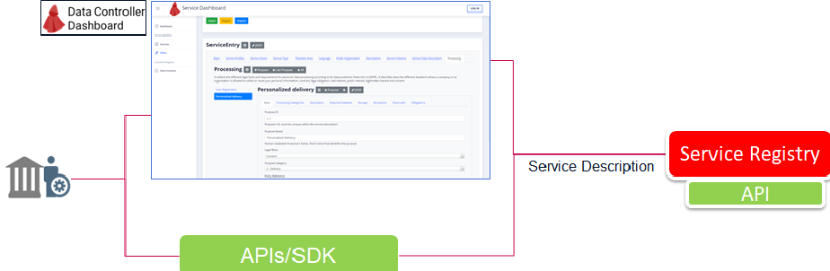
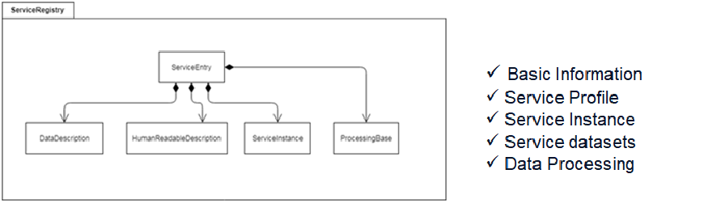

# 1. Service Description and Registration

The Service registration on Cape consists of two mandatory steps:

 - **Service Description**
 - **Service Registration**

## Service Description 
Each service that will interact with CaPe must be described and registered in the CaPe platform (Service Registry). 
The description in particular provides, as well as basic information, the description of the data that will be processed for each purpose with reference to a specific privacy statement.

As depicted in following figure, the Data Controller can describe the service and create Service Description metamodel either:

  1. Using the Service Editor tool provided in the Data Controller Dashboard.
     See the [Data Controller Dashboard section](dashboards/data-controller-dashboard/index.md) ).
	 
  2. Issuing directly the Service Description through specific APIs exposed by Service Registry and accessed through [Cape SDK APIs]().

Service Description refers to a specific metamodel, defined by extending MyData specifications and ISA2 Common Public Service Vocabulary Application Profile (CPSV-AP) and specifying semantic description of legal basis of personal data processing.

**Note**. 
See the [Service Registry Apiary]('') and [Service Description section of Data Controller Dashboard](../dashboards/data-controller-dashboard/service-description.md) for further information on Service Description metamodel and examples (JSON body to be issued to Service Registry API or imported in Service Editor section of Data Controller Dashboard).

----

## Service Registration

Once the Service description has been formalized and stored in the CaPe Service Registry, the Data Controller must make it "registered" in CaPe Service Registry.

Following steps are performed when registering a Service description:

  - A Signing key pair (RSA) is created and saved in the SDK storage; it will be used for signing Service Link Records relative to that service.
  - A X509 public certificate is created (signed with private part) and added in the Service Description (cert field of Service Instance).
    It will be used by CaPe (Account Manager) to verify the SLR signature.

This registration phase implies that the description is versioned, timestamped and hash digested, in order to "fix" that particular version and to make it available to the End User (Data Subject) through the [**User Self-Service Dashboard**](../dashboards/user-dashboard/index.md).
