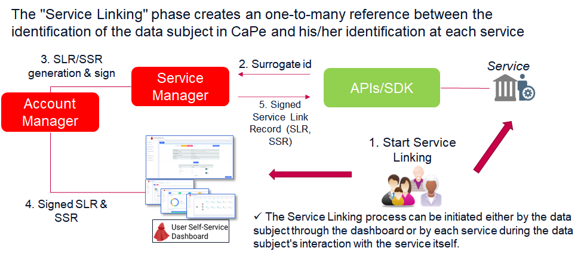

# 2. Service Linking

In order to interact with a specific Data Subject and request a lawfully data processing consent, each registered service must be linked with a specific User's Cape Account that identifies the data subject at CaPe system.

This "Service Linking" phase creates an one-to-many reference between the identification of the data subject at CaPe (**Account Id** and his/her identification at each service (**Surrogate Id**).
The overall process is transactional and regulated by the Service Manager acting as Orchestrator, which holds and updates a Linking Session, according to the distributed transaction SAGA pattern.

The Service Linking phase is based on a process of identification, and possibly authentication of the data subject both at CaPe (i.e. through the dashboard) and at the service. The identification and authentication process can include several cases:

- CaPe and each service use different Identity Managers (IdM),
- CaPe uses a specific IdM (CaPe IdM) and all services use a unique IDM, as they belong to the same organization   (eg organization single sign-on SSO),
- IdM completely "as a service" provided by CaPe.

In all the aforementioned cases the SDK allows, and in the case through the adoption of specific data connectors, the relative identification (and possible authentication) process requested for the Service Linking. 
All references for identification/authentication through the SDK must be entered in the service description and registration phase (eg linking URI, redirect Linking URI ...see [Data Controller Dashboard section](../dashboards/data-controller-dashboard/index.md) for further details).

---
## Key concepts

To summarize following are the key concepts of this phase in the CaPe workflow:

  - **Service​ ​Link​ ​Record​ ​(SLR)**:​ ​is​ ​the​ ​outcome​ ​of​ ​a​ ​successful​ ​Service​ ​Linking.​ ​It​ ​documents​ ​in​ ​machine
   readable​ ​form​ ​the​ ​terms​ ​and​ ​scope​ ​of​ ​the​ ​agreement​ ​between​ ​the​ ​User's Cape Account​ and​ ​a​ ​single​ ​Source
   or​ ​Sink service. 
   It is an immutable record, signed both with the Cape User Account's private key and with the private key of the linked service, according to [IETF Json Web Signature (JWS) specification](https://tools.ietf.org/html/rfc7515).
   

       The​ ​JWS​ ​headers​ ​MUST​ ​contain​ ​‘kid’​ ​fields​ ​identifying​ Cape User Account's
       and​ ​Service’s​ ​key​ ​pairs​ ​used​ ​to​ ​sign​ ​Service​ ​Link​ ​Record​.

    Service​ ​Link​ ​Records​ ​are​ ​stored​ ​both in​ ​the​ ​Account Manager​ ​and​ ​in​ ​the​ ​service.

  - **Service​ ​Link​ ​Status​ ​Record​ ​(SSR)​**: ​​is​ ​a​n ​immutable, timestamped, signed record that CaPe​ ​sends​ ​to​ ​a​ ​service​ ​when​ ​status​ ​of​ ​a Service​ ​Link​ ​changes (active, removed).​ 
     This is the dinamic part of the SLR, contained in a related list which represents the SLR status history.
    ​ Service​ ​MUST​ ​store​ ​these​ ​records​ ​for​ ​future​ ​use (through the CaPe SDK).
	
  - **Surrogate​ ​ID**​: ​​is​ ​a​ ​pseudonym​ ​that​ ​associates​ ​User's Cape Account​ ​to​ ​his​ ​/​ ​her​ ​account at​ ​the​ ​service​ ​being​ ​linked.​  

---

The figure above depicts the overall service linking process, which involves following steps:
 
  1. End User (Data Subject) starts the service linking process.
    It can be initiated either:
      - by the data subject through the Use Self-Service Dashboard at CaPe;
	  - by each service during the data subject's interaction with the service itself.
	  
  2. Cape (SDK) generates the Surrogate ID.
      - In the first case (linking started from dashboard), the user, already supplied with a CaPe account and authenticated through the dashboard, can select a specific service from the CaPe services catalog and associate it (link) with his account. This association, depending on the cases described above related to the identification process, may include a redirect to the identification/authentication page, or registration in the case of a new user, at the service, which will return the identifier of user (surrogateID) via the SDK for the creation of the "service link" association. The process is simplified if both CaPe and the service refer to the same IDM.
      - In the second case (linking started from service), the process triggers the creation of Cape account if it has not been previously created.
    
  3. CaPe (Service Manager & Account Manager) creates the double signed JWSs representing the Service Link Record (**SLR**) and the first Service Link Status Record (**SSR**, set to active), in detail:
  
     * 3a. The partial JWS payloads of SLR and SSR records are initializiated by Service Manager.
	 * 3b. SLR and SSR Payloads are signed by Account Manager with User's account private key (RSA).
	 * 3c. The Account's signature is validated by Service Manager with User's account public key.
	 * 3d. Service Manager in turn signs the payloads with the Service's private key (RSA) and appends also its signature to the JWS.
	 * 3e. Finally Account Manager validates the Service's signature and Service Manager finalizes the linking process.
	 
	**Note**. In​ ​case​ ​of​ ​a​ ​Sink​ ​service​ ​being​ ​linked,​ ​the partial SLR payload will contain also the​ ​public part​ ​of​ ​Proof-of-Possession​ ​Key (**PoP Key**)​, generated ​from​ ​service.
	​ The private part of this PoP key will be later used by Sink service for signing Data Requests and its public part used by Source service to verify them.
	  
  4. SLR and SSR are saved in CaPe and related service is visualizated as "Linked" in the CaPe User Dashboard.
  
  5. Copies of SLR and SSR are forwarded and stored to the service through the SDK APis. Service must verify the record signatures against the public key.
  

