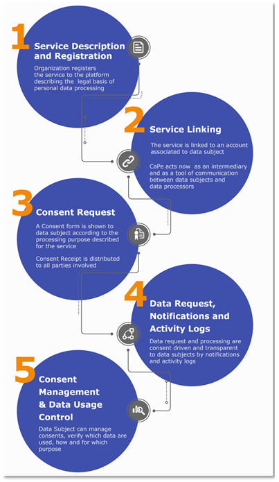
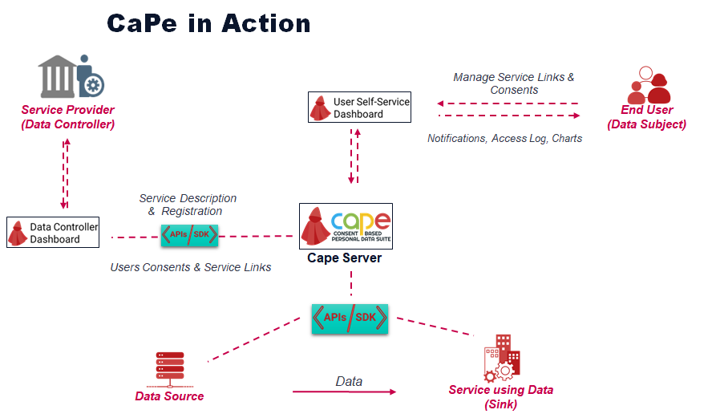

# CaPe Workflow - Introduction

Each CaPe core component is involved to support the end to end process of consent management.
In order to use all the functionalities, a workflow has been designed and consists of the following steps:

 1. **Service description and registration**
 2. **Service Linking**
 3. **Consent Request (for processing within a service or sharing among services)**
 4. **Data Request, Notification and Activity Logs**
 5. **Consent Management & User Data Usage Control**

The following picture depicts the workflow provided by CaPe Suite.

	

The following picture depicts interactions occuring between Cape platform component during the steps listed above.

	

